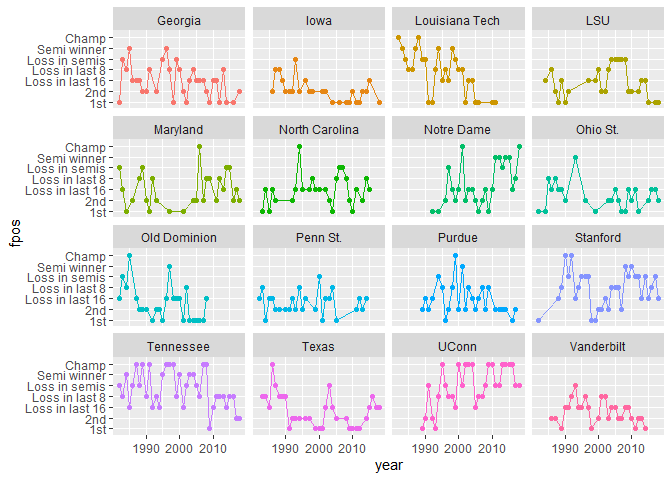
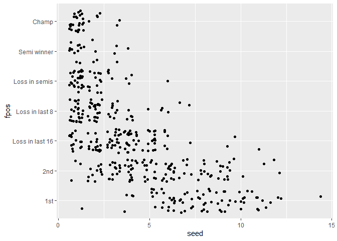

TidyTuesday 2020-10-06
================
06/10/2020

## Load packages and data

``` r
library(tidyverse)
```

    ## -- Attaching packages ------------------------------------------------ tidyverse 1.3.0 --

    ## v ggplot2 3.3.2     v purrr   0.3.4
    ## v tibble  3.0.3     v dplyr   1.0.2
    ## v tidyr   1.1.2     v stringr 1.4.0
    ## v readr   1.3.1     v forcats 0.5.0

    ## -- Conflicts --------------------------------------------------- tidyverse_conflicts() --
    ## x dplyr::filter() masks stats::filter()
    ## x dplyr::lag()    masks stats::lag()

``` r
tuesdata <- tidytuesdayR::tt_load('2020-10-06')
```

    ## --- Compiling #TidyTuesday Information for 2020-10-06 ----

    ## --- There is 1 file available ---

    ## --- Starting Download ---

    ## 
    ##  Downloading file 1 of 1: `tournament.csv`

    ## --- Download complete ---

``` r
tournament <- tuesdata$tournament
names(tournament)
```

    ##  [1] "year"              "school"            "seed"             
    ##  [4] "conference"        "conf_w"            "conf_l"           
    ##  [7] "conf_percent"      "conf_place"        "reg_w"            
    ## [10] "reg_l"             "reg_percent"       "how_qual"         
    ## [13] "x1st_game_at_home" "tourney_w"         "tourney_l"        
    ## [16] "tourney_finish"    "full_w"            "full_l"           
    ## [19] "full_percent"

``` r
summary(tournament)
```

    ##       year         school               seed         conference       
    ##  Min.   :1982   Length:2092        Min.   : 1.000   Length:2092       
    ##  1st Qu.:1994   Class :character   1st Qu.: 4.000   Class :character  
    ##  Median :2002   Mode  :character   Median : 8.000   Mode  :character  
    ##  Mean   :2002                      Mean   : 7.852                     
    ##  3rd Qu.:2010                      3rd Qu.:12.000                     
    ##  Max.   :2018                      Max.   :16.000                     
    ##                                    NA's   :8                          
    ##      conf_w          conf_l        conf_percent     conf_place       
    ##  Min.   : 3.00   Min.   : 0.000   Min.   : 21.40   Length:2092       
    ##  1st Qu.:10.00   1st Qu.: 2.000   1st Qu.: 66.70   Class :character  
    ##  Median :12.00   Median : 3.000   Median : 78.60   Mode  :character  
    ##  Mean   :12.04   Mean   : 3.552   Mean   : 77.17                     
    ##  3rd Qu.:14.00   3rd Qu.: 5.000   3rd Qu.: 88.90                     
    ##  Max.   :20.00   Max.   :14.000   Max.   :100.00                     
    ##  NA's   :61      NA's   :61       NA's   :61                         
    ##      reg_w          reg_l         reg_percent       how_qual        
    ##  Min.   :10.0   Min.   : 0.000   Min.   : 41.40   Length:2092       
    ##  1st Qu.:20.0   1st Qu.: 5.000   1st Qu.: 68.80   Class :character  
    ##  Median :23.0   Median : 7.000   Median : 75.90   Mode  :character  
    ##  Mean   :22.9   Mean   : 7.183   Mean   : 76.08                     
    ##  3rd Qu.:25.0   3rd Qu.: 9.000   3rd Qu.: 83.30                     
    ##  Max.   :34.0   Max.   :18.000   Max.   :100.00                     
    ##                                                                     
    ##  x1st_game_at_home    tourney_w        tourney_l      tourney_finish    
    ##  Length:2092        Min.   :0.0000   Min.   :0.0000   Length:2092       
    ##  Class :character   1st Qu.:0.0000   1st Qu.:1.0000   Class :character  
    ##  Mode  :character   Median :1.0000   Median :1.0000   Mode  :character  
    ##                     Mean   :0.9847   Mean   :0.9823                     
    ##                     3rd Qu.:1.0000   3rd Qu.:1.0000                     
    ##                     Max.   :6.0000   Max.   :1.0000                     
    ##                                                                         
    ##      full_w          full_l        full_percent   
    ##  Min.   :12.00   Min.   : 0.000   Min.   : 36.90  
    ##  1st Qu.:21.00   1st Qu.: 6.000   1st Qu.: 67.60  
    ##  Median :23.00   Median : 8.000   Median : 74.20  
    ##  Mean   :23.89   Mean   : 8.195   Mean   : 74.24  
    ##  3rd Qu.:26.00   3rd Qu.:10.000   3rd Qu.: 81.30  
    ##  Max.   :40.00   Max.   :53.000   Max.   :100.00  
    ## 

``` r
table(tournament$year)
```

    ## 
    ## 1982 1983 1984 1985 1986 1987 1988 1989 1990 1991 1992 1993 1994 1995 1996 1997 
    ##   32   36   32   32   40   40   40   48   48   48   48   48   64   64   64   64 
    ## 1998 1999 2000 2001 2002 2003 2004 2005 2006 2007 2008 2009 2010 2011 2012 2013 
    ##   64   64   64   64   64   64   64   64   64   64   64   64   64   64   64   64 
    ## 2014 2015 2016 2017 2018 
    ##   64   64   64   64   64

``` r
table(tournament$seed)
```

    ## 
    ##   1   2   3   4   5   6   7   8   9  10  11  12  13  14  15  16 
    ## 149 147 149 148 149 147 149 141 131 132 120 123  99  99 100 101

``` r
sort(table(tournament$school), TRUE)[1:20]
```

    ## 
    ##      Tennessee        Georgia       Stanford          Texas          UConn 
    ##             37             33             32             31             30 
    ## Louisiana Tech     Vanderbilt            LSU       Maryland North Carolina 
    ##             27             27             26             26             26 
    ##         Purdue           Iowa     Notre Dame       Ohio St.   Old Dominion 
    ##             26             25             25             25             25 
    ##       Penn St.       Virginia           Duke       NC State        Rutgers 
    ##             25             25             24             24             24

``` r
table(tournament$tourney_finish)
```

    ## 
    ##   1st   2nd Champ  N2nd   NSF    OR    RF   RSF 
    ##   967   529    37    37    74     4   148   296

``` r
tournament %>%
  group_by(tourney_finish) %>%
  count()
```

    ## # A tibble: 8 x 2
    ## # Groups:   tourney_finish [8]
    ##   tourney_finish     n
    ##   <chr>          <int>
    ## 1 1st              967
    ## 2 2nd              529
    ## 3 Champ             37
    ## 4 N2nd              37
    ## 5 NSF               74
    ## 6 OR                 4
    ## 7 RF               148
    ## 8 RSF              296

``` r
# top 16 schools
top16 <- tournament %>%
  group_by(school) %>%
  count(sort = TRUE) %>%
  ungroup() %>%
  slice(1:16) %>%
  select(school)


dat <- tournament %>%
  mutate(pos = case_when(tourney_finish == "1st" ~ 1,
                         tourney_finish == "2nd" ~ 2,
                         tourney_finish == "RSF" ~ 3,
                         tourney_finish == "RF" ~ 4,
                         tourney_finish == "NSF" ~ 5,
                         tourney_finish == "N2nd" ~ 6,
                         tourney_finish == "Champ" ~ 7),
         fpos = factor(pos, 1:7, c("1st", "2nd", "Loss in last 16", 
                                   "Loss in last 8", "Loss in semis", 
                                   "Semi winner", "Champ"))) %>%
  filter(school %in% top16$school)
  # group_by(school) %>%
  # mutate(N = n()) %>% 
  # ungroup()
```

Plot position

``` r
ggplot(dat, aes(x = year, y = fpos, group = school, col = factor(school))) +
  geom_point() +
  geom_line() + 
  facet_wrap(vars(school)) + 
  theme(legend.position="none")
```

<!-- -->

Does seed predict position?

``` r
ggplot(dat, aes(x = seed, y = fpos)) +
  geom_jitter()
```

<!-- -->

### Session Info

``` r
sessionInfo()
```

    ## R version 4.0.2 (2020-06-22)
    ## Platform: i386-w64-mingw32/i386 (32-bit)
    ## Running under: Windows 10 x64 (build 18362)
    ## 
    ## Matrix products: default
    ## 
    ## locale:
    ## [1] LC_COLLATE=English_United Kingdom.1252 
    ## [2] LC_CTYPE=English_United Kingdom.1252   
    ## [3] LC_MONETARY=English_United Kingdom.1252
    ## [4] LC_NUMERIC=C                           
    ## [5] LC_TIME=English_United Kingdom.1252    
    ## 
    ## attached base packages:
    ## [1] stats     graphics  grDevices utils     datasets  methods   base     
    ## 
    ## other attached packages:
    ## [1] forcats_0.5.0   stringr_1.4.0   dplyr_1.0.2     purrr_0.3.4    
    ## [5] readr_1.3.1     tidyr_1.1.2     tibble_3.0.3    ggplot2_3.3.2  
    ## [9] tidyverse_1.3.0
    ## 
    ## loaded via a namespace (and not attached):
    ##  [1] tidyselect_1.1.0   xfun_0.18          haven_2.3.1        colorspace_1.4-1  
    ##  [5] vctrs_0.3.4        generics_0.0.2     htmltools_0.5.0    usethis_1.6.3     
    ##  [9] yaml_2.2.1         utf8_1.1.4         blob_1.2.1         rlang_0.4.7       
    ## [13] pillar_1.4.6       glue_1.4.2         withr_2.3.0        DBI_1.1.0         
    ## [17] selectr_0.4-2      dbplyr_1.4.4       modelr_0.1.8       readxl_1.3.1      
    ## [21] lifecycle_0.2.0    munsell_0.5.0      gtable_0.3.0       cellranger_1.1.0  
    ## [25] rvest_0.3.6        evaluate_0.14      labeling_0.3       knitr_1.30        
    ## [29] curl_4.3           fansi_0.4.1        broom_0.7.1        Rcpp_1.0.5        
    ## [33] scales_1.1.1       backports_1.1.10   jsonlite_1.7.1     farver_2.0.3      
    ## [37] fs_1.5.0           hms_0.5.3          digest_0.6.25      stringi_1.5.3     
    ## [41] grid_4.0.2         cli_2.0.2          tools_4.0.2        magrittr_1.5      
    ## [45] crayon_1.3.4       pkgconfig_2.0.3    ellipsis_0.3.1     xml2_1.3.2        
    ## [49] reprex_0.3.0       lubridate_1.7.9    assertthat_0.2.1   rmarkdown_2.4     
    ## [53] httr_1.4.2         tidytuesdayR_1.0.1 rstudioapi_0.11    R6_2.4.1          
    ## [57] compiler_4.0.2
