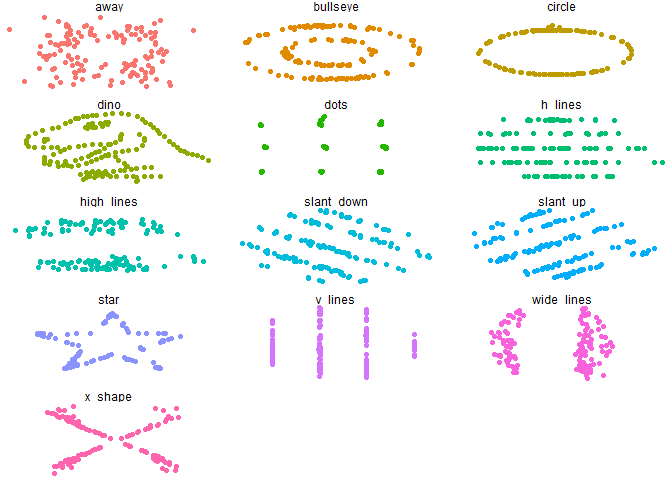
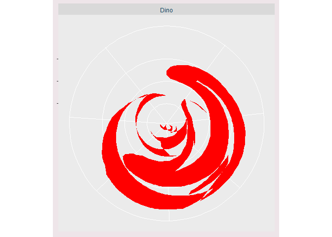

Datasaurus - TidyTuesday 2020-10-13
================
19/10/2020

``` r
tuesdata <- tidytuesdayR::tt_load('2020-10-13')
```

    ## --- Compiling #TidyTuesday Information for 2020-10-13 ----

    ## --- There is 1 file available ---

    ## --- Starting Download ---

    ## 
    ##  Downloading file 1 of 1: `datasaurus.csv`

    ## --- Download complete ---

``` r
datasaurus <- tuesdata$datasaurus
```

``` r
library(tidyverse)
```

    ## -- Attaching packages -------------------------- tidyverse 1.3.0 --

    ## v ggplot2 3.3.2     v purrr   0.3.4
    ## v tibble  3.0.3     v dplyr   1.0.2
    ## v tidyr   1.1.2     v stringr 1.4.0
    ## v readr   1.3.1     v forcats 0.5.0

    ## -- Conflicts ----------------------------- tidyverse_conflicts() --
    ## x dplyr::filter() masks stats::filter()
    ## x dplyr::lag()    masks stats::lag()

``` r
datasaurus %>% 
  ggplot(aes(x = x, y = y, colour=dataset)) +
  geom_point() +
  theme_void() +
  theme(legend.position = "none") +
  facet_wrap(~dataset, ncol=3)
```

<!-- -->

``` r
library(gtsummary)
```

    ## Warning: package 'gtsummary' was built under R version 4.0.3

``` r
datasaurus %>%
  # select(-dataset) %>%
  tbl_summary(by = dataset, 
              statistic = all_continuous() ~ "{mean} ({sd})")
```

<!--html_preserve-->

<style>html {
  font-family: -apple-system, BlinkMacSystemFont, 'Segoe UI', Roboto, Oxygen, Ubuntu, Cantarell, 'Helvetica Neue', 'Fira Sans', 'Droid Sans', Arial, sans-serif;
}

#yignlwlhzp .gt_table {
  display: table;
  border-collapse: collapse;
  margin-left: auto;
  margin-right: auto;
  color: #333333;
  font-size: 16px;
  font-weight: normal;
  font-style: normal;
  background-color: #FFFFFF;
  width: auto;
  border-top-style: solid;
  border-top-width: 2px;
  border-top-color: #A8A8A8;
  border-right-style: none;
  border-right-width: 2px;
  border-right-color: #D3D3D3;
  border-bottom-style: solid;
  border-bottom-width: 2px;
  border-bottom-color: #A8A8A8;
  border-left-style: none;
  border-left-width: 2px;
  border-left-color: #D3D3D3;
}

#yignlwlhzp .gt_heading {
  background-color: #FFFFFF;
  text-align: center;
  border-bottom-color: #FFFFFF;
  border-left-style: none;
  border-left-width: 1px;
  border-left-color: #D3D3D3;
  border-right-style: none;
  border-right-width: 1px;
  border-right-color: #D3D3D3;
}

#yignlwlhzp .gt_title {
  color: #333333;
  font-size: 125%;
  font-weight: initial;
  padding-top: 4px;
  padding-bottom: 4px;
  border-bottom-color: #FFFFFF;
  border-bottom-width: 0;
}

#yignlwlhzp .gt_subtitle {
  color: #333333;
  font-size: 85%;
  font-weight: initial;
  padding-top: 0;
  padding-bottom: 4px;
  border-top-color: #FFFFFF;
  border-top-width: 0;
}

#yignlwlhzp .gt_bottom_border {
  border-bottom-style: solid;
  border-bottom-width: 2px;
  border-bottom-color: #D3D3D3;
}

#yignlwlhzp .gt_col_headings {
  border-top-style: solid;
  border-top-width: 2px;
  border-top-color: #D3D3D3;
  border-bottom-style: solid;
  border-bottom-width: 2px;
  border-bottom-color: #D3D3D3;
  border-left-style: none;
  border-left-width: 1px;
  border-left-color: #D3D3D3;
  border-right-style: none;
  border-right-width: 1px;
  border-right-color: #D3D3D3;
}

#yignlwlhzp .gt_col_heading {
  color: #333333;
  background-color: #FFFFFF;
  font-size: 100%;
  font-weight: normal;
  text-transform: inherit;
  border-left-style: none;
  border-left-width: 1px;
  border-left-color: #D3D3D3;
  border-right-style: none;
  border-right-width: 1px;
  border-right-color: #D3D3D3;
  vertical-align: bottom;
  padding-top: 5px;
  padding-bottom: 6px;
  padding-left: 5px;
  padding-right: 5px;
  overflow-x: hidden;
}

#yignlwlhzp .gt_column_spanner_outer {
  color: #333333;
  background-color: #FFFFFF;
  font-size: 100%;
  font-weight: normal;
  text-transform: inherit;
  padding-top: 0;
  padding-bottom: 0;
  padding-left: 4px;
  padding-right: 4px;
}

#yignlwlhzp .gt_column_spanner_outer:first-child {
  padding-left: 0;
}

#yignlwlhzp .gt_column_spanner_outer:last-child {
  padding-right: 0;
}

#yignlwlhzp .gt_column_spanner {
  border-bottom-style: solid;
  border-bottom-width: 2px;
  border-bottom-color: #D3D3D3;
  vertical-align: bottom;
  padding-top: 5px;
  padding-bottom: 6px;
  overflow-x: hidden;
  display: inline-block;
  width: 100%;
}

#yignlwlhzp .gt_group_heading {
  padding: 8px;
  color: #333333;
  background-color: #FFFFFF;
  font-size: 100%;
  font-weight: initial;
  text-transform: inherit;
  border-top-style: solid;
  border-top-width: 2px;
  border-top-color: #D3D3D3;
  border-bottom-style: solid;
  border-bottom-width: 2px;
  border-bottom-color: #D3D3D3;
  border-left-style: none;
  border-left-width: 1px;
  border-left-color: #D3D3D3;
  border-right-style: none;
  border-right-width: 1px;
  border-right-color: #D3D3D3;
  vertical-align: middle;
}

#yignlwlhzp .gt_empty_group_heading {
  padding: 0.5px;
  color: #333333;
  background-color: #FFFFFF;
  font-size: 100%;
  font-weight: initial;
  border-top-style: solid;
  border-top-width: 2px;
  border-top-color: #D3D3D3;
  border-bottom-style: solid;
  border-bottom-width: 2px;
  border-bottom-color: #D3D3D3;
  vertical-align: middle;
}

#yignlwlhzp .gt_from_md > :first-child {
  margin-top: 0;
}

#yignlwlhzp .gt_from_md > :last-child {
  margin-bottom: 0;
}

#yignlwlhzp .gt_row {
  padding-top: 8px;
  padding-bottom: 8px;
  padding-left: 5px;
  padding-right: 5px;
  margin: 10px;
  border-top-style: solid;
  border-top-width: 1px;
  border-top-color: #D3D3D3;
  border-left-style: none;
  border-left-width: 1px;
  border-left-color: #D3D3D3;
  border-right-style: none;
  border-right-width: 1px;
  border-right-color: #D3D3D3;
  vertical-align: middle;
  overflow-x: hidden;
}

#yignlwlhzp .gt_stub {
  color: #333333;
  background-color: #FFFFFF;
  font-size: 100%;
  font-weight: initial;
  text-transform: inherit;
  border-right-style: solid;
  border-right-width: 2px;
  border-right-color: #D3D3D3;
  padding-left: 12px;
}

#yignlwlhzp .gt_summary_row {
  color: #333333;
  background-color: #FFFFFF;
  text-transform: inherit;
  padding-top: 8px;
  padding-bottom: 8px;
  padding-left: 5px;
  padding-right: 5px;
}

#yignlwlhzp .gt_first_summary_row {
  padding-top: 8px;
  padding-bottom: 8px;
  padding-left: 5px;
  padding-right: 5px;
  border-top-style: solid;
  border-top-width: 2px;
  border-top-color: #D3D3D3;
}

#yignlwlhzp .gt_grand_summary_row {
  color: #333333;
  background-color: #FFFFFF;
  text-transform: inherit;
  padding-top: 8px;
  padding-bottom: 8px;
  padding-left: 5px;
  padding-right: 5px;
}

#yignlwlhzp .gt_first_grand_summary_row {
  padding-top: 8px;
  padding-bottom: 8px;
  padding-left: 5px;
  padding-right: 5px;
  border-top-style: double;
  border-top-width: 6px;
  border-top-color: #D3D3D3;
}

#yignlwlhzp .gt_striped {
  background-color: rgba(128, 128, 128, 0.05);
}

#yignlwlhzp .gt_table_body {
  border-top-style: solid;
  border-top-width: 2px;
  border-top-color: #D3D3D3;
  border-bottom-style: solid;
  border-bottom-width: 2px;
  border-bottom-color: #D3D3D3;
}

#yignlwlhzp .gt_footnotes {
  color: #333333;
  background-color: #FFFFFF;
  border-bottom-style: none;
  border-bottom-width: 2px;
  border-bottom-color: #D3D3D3;
  border-left-style: none;
  border-left-width: 2px;
  border-left-color: #D3D3D3;
  border-right-style: none;
  border-right-width: 2px;
  border-right-color: #D3D3D3;
}

#yignlwlhzp .gt_footnote {
  margin: 0px;
  font-size: 90%;
  padding: 4px;
}

#yignlwlhzp .gt_sourcenotes {
  color: #333333;
  background-color: #FFFFFF;
  border-bottom-style: none;
  border-bottom-width: 2px;
  border-bottom-color: #D3D3D3;
  border-left-style: none;
  border-left-width: 2px;
  border-left-color: #D3D3D3;
  border-right-style: none;
  border-right-width: 2px;
  border-right-color: #D3D3D3;
}

#yignlwlhzp .gt_sourcenote {
  font-size: 90%;
  padding: 4px;
}

#yignlwlhzp .gt_left {
  text-align: left;
}

#yignlwlhzp .gt_center {
  text-align: center;
}

#yignlwlhzp .gt_right {
  text-align: right;
  font-variant-numeric: tabular-nums;
}

#yignlwlhzp .gt_font_normal {
  font-weight: normal;
}

#yignlwlhzp .gt_font_bold {
  font-weight: bold;
}

#yignlwlhzp .gt_font_italic {
  font-style: italic;
}

#yignlwlhzp .gt_super {
  font-size: 65%;
}

#yignlwlhzp .gt_footnote_marks {
  font-style: italic;
  font-size: 65%;
}
</style>

<div id="yignlwlhzp" style="overflow-x:auto;overflow-y:auto;width:auto;height:auto;">

<table class="gt_table">

<thead class="gt_col_headings">

<tr>

<th class="gt_col_heading gt_columns_bottom_border gt_left" rowspan="1" colspan="1">

<strong>Characteristic</strong>

</th>

<th class="gt_col_heading gt_columns_bottom_border gt_center" rowspan="1" colspan="1">

<strong>away</strong>, N = 142<sup class="gt_footnote_marks">1</sup>

</th>

<th class="gt_col_heading gt_columns_bottom_border gt_center" rowspan="1" colspan="1">

<strong>bullseye</strong>, N = 142<sup class="gt_footnote_marks">1</sup>

</th>

<th class="gt_col_heading gt_columns_bottom_border gt_center" rowspan="1" colspan="1">

<strong>circle</strong>, N = 142<sup class="gt_footnote_marks">1</sup>

</th>

<th class="gt_col_heading gt_columns_bottom_border gt_center" rowspan="1" colspan="1">

<strong>dino</strong>, N = 142<sup class="gt_footnote_marks">1</sup>

</th>

<th class="gt_col_heading gt_columns_bottom_border gt_center" rowspan="1" colspan="1">

<strong>dots</strong>, N = 142<sup class="gt_footnote_marks">1</sup>

</th>

<th class="gt_col_heading gt_columns_bottom_border gt_center" rowspan="1" colspan="1">

<strong>h\_lines</strong>, N = 142<sup class="gt_footnote_marks">1</sup>

</th>

<th class="gt_col_heading gt_columns_bottom_border gt_center" rowspan="1" colspan="1">

<strong>high\_lines</strong>, N =
142<sup class="gt_footnote_marks">1</sup>

</th>

<th class="gt_col_heading gt_columns_bottom_border gt_center" rowspan="1" colspan="1">

<strong>slant\_down</strong>, N =
142<sup class="gt_footnote_marks">1</sup>

</th>

<th class="gt_col_heading gt_columns_bottom_border gt_center" rowspan="1" colspan="1">

<strong>slant\_up</strong>, N =
142<sup class="gt_footnote_marks">1</sup>

</th>

<th class="gt_col_heading gt_columns_bottom_border gt_center" rowspan="1" colspan="1">

<strong>star</strong>, N = 142<sup class="gt_footnote_marks">1</sup>

</th>

<th class="gt_col_heading gt_columns_bottom_border gt_center" rowspan="1" colspan="1">

<strong>v\_lines</strong>, N = 142<sup class="gt_footnote_marks">1</sup>

</th>

<th class="gt_col_heading gt_columns_bottom_border gt_center" rowspan="1" colspan="1">

<strong>wide\_lines</strong>, N =
142<sup class="gt_footnote_marks">1</sup>

</th>

<th class="gt_col_heading gt_columns_bottom_border gt_center" rowspan="1" colspan="1">

<strong>x\_shape</strong>, N = 142<sup class="gt_footnote_marks">1</sup>

</th>

</tr>

</thead>

<tbody class="gt_table_body">

<tr>

<td class="gt_row gt_left">

x

</td>

<td class="gt_row gt_center">

54 (17)

</td>

<td class="gt_row gt_center">

54 (17)

</td>

<td class="gt_row gt_center">

54 (17)

</td>

<td class="gt_row gt_center">

54 (17)

</td>

<td class="gt_row gt_center">

54 (17)

</td>

<td class="gt_row gt_center">

54 (17)

</td>

<td class="gt_row gt_center">

54 (17)

</td>

<td class="gt_row gt_center">

54 (17)

</td>

<td class="gt_row gt_center">

54 (17)

</td>

<td class="gt_row gt_center">

54 (17)

</td>

<td class="gt_row gt_center">

54 (17)

</td>

<td class="gt_row gt_center">

54 (17)

</td>

<td class="gt_row gt_center">

54 (17)

</td>

</tr>

<tr>

<td class="gt_row gt_left">

y

</td>

<td class="gt_row gt_center">

48 (27)

</td>

<td class="gt_row gt_center">

48 (27)

</td>

<td class="gt_row gt_center">

48 (27)

</td>

<td class="gt_row gt_center">

48 (27)

</td>

<td class="gt_row gt_center">

48 (27)

</td>

<td class="gt_row gt_center">

48 (27)

</td>

<td class="gt_row gt_center">

48 (27)

</td>

<td class="gt_row gt_center">

48 (27)

</td>

<td class="gt_row gt_center">

48 (27)

</td>

<td class="gt_row gt_center">

48 (27)

</td>

<td class="gt_row gt_center">

48 (27)

</td>

<td class="gt_row gt_center">

48 (27)

</td>

<td class="gt_row gt_center">

48 (27)

</td>

</tr>

</tbody>

<tfoot>

<tr class="gt_footnotes">

<td colspan="14">

<p class="gt_footnote">

<sup class="gt_footnote_marks"> <em>1</em> </sup>

Statistics presented: Mean (SD) <br />

</p>

</td>

</tr>

</tfoot>

</table>

</div>

<!--/html_preserve-->

``` r
library(ggpolypath)
```

    ## Warning: package 'ggpolypath' was built under R version 4.0.3

``` r
dino <- ggplot(filter(datasaurus, dataset == "dino"), aes(x = x, y = y)) +
  geom_polypath(fill = "red") +
  scale_color_identity() +
  facet_wrap(~dataset, nrow = 5, labeller = as_labeller(tools::toTitleCase)) +
  coord_polar() +
  labs(x = NULL,
       y = NULL) +
  theme(plot.title = element_text(color ="#08415C"),
        strip.text = element_text(color = "#08415C", hjust = 0.5),
        plot.background = element_rect(fill = "#eee5e9", color = "#eee5e9"),
        axis.text.x = element_blank(),
        axis.text.y = element_blank())

dino
```

<!-- -->
