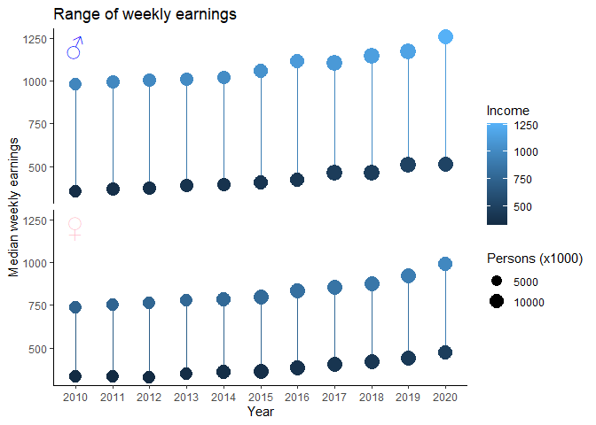

TidyTuesday 2021-02-23
================
23/02/2021

``` r
employed %>%
  filter(minor_occupation == "Farming, fishing, and forestry occupations") %>%
  filter(race_gender %in% c("Men", "Women")) %>% 
  group_by(year, major_occupation, race_gender) %>%
  summarize(across(c("industry_total", "employ_n"), sum, na.rm = TRUE)) %>% 
  mutate(employ_n = employ_n/1000) %>% 
  # group_by(race_gender) %>%
  # count()
  
  ggplot(aes(x = year, y = employ_n)) +
  geom_point(aes(pch = factor(race_gender))) +
  geom_line(aes(group = factor(race_gender))) + 
  scale_y_continuous(labels = function(x) format(x, big.mark = ",")) + 
  theme_classic() +
  ylab("Number employed (1000s)") +
  ggtitle("Employees in farming, fishing and forestry occupations") +
  labs(pch = "Sex")
```

    ## `summarise()` regrouping output by 'year', 'major_occupation' (override with `.groups` argument)

<!-- -->

``` r
earn2 <- earn %>%
  filter(race == "All Races", 
         ethnic_origin == "All Origins", 
         sex %in% c("Men", "Women")) %>%
  group_by(year, sex, age) %>%
  summarize(across(c("median_weekly_earn", "n_persons"), median, na.rm = TRUE),
            sum_persons = sum(n_persons, na.rm = TRUE))
```

    ## `summarise()` regrouping output by 'year', 'sex' (override with `.groups` argument)

``` r
earn2 %>% 
  ggplot(aes(x = factor(year), y = median_weekly_earn)) +
  # geom_point(aes(color = median_weekly_earn)) +
  geom_dotplot(stackdir = "center", binaxis = "y", 
               mapping = aes(color = median_weekly_earn)) +
  theme_classic() + 
  facet_grid(vars(sex), ) +
  xlab("Year") +
  ylab("Median weekly earnings by age") +
  ggtitle("Weekly earnings by sex") +
  geom_point(data = data.frame(x = 1, y = 1250), 
             mapping = aes(x = x, y = y), 
             pch = c("\u2642", "\u2640"), 
             size = 7,
             col = c("blue", "pink")) + 
  theme(
    strip.background = element_blank(),
    strip.text.y = element_blank()
  )
```

    ## `stat_bindot()` using `bins = 30`. Pick better value with `binwidth`.

<!-- -->

``` r
earn3 <- earn2 %>%
  mutate(
    min = min(median_weekly_earn),
    max = max(median_weekly_earn),
    med = median(median_weekly_earn),
    sum_persons = sum_persons/1000
  ) %>% 
  filter(median_weekly_earn == min | median_weekly_earn == max)
  
ggplot(aes(x = factor(year), xend = factor(year)), data = earn3) +
  geom_segment(mapping = aes(y = min, yend = max, col = med)) +
  geom_point(mapping = aes(y = min, col = min, size = sum_persons)) +
  geom_point(mapping = aes(y = max, col = max, size = sum_persons)) +
  theme_classic() + 
  facet_grid(vars(sex), ) +
  xlab("Year") +
  ylab("Median weekly earnings") +
  ggtitle("Range of weekly earnings") +
  geom_point(data = data.frame(year = factor(2010), y = 1200), 
             mapping = aes(x = year, y = y), 
             pch = c("\u2642", "\u2640"), 
             size = 7,
             col = c("blue", "pink")) + 
  theme(
    strip.background = element_blank(),
    strip.text.y = element_blank()
  ) +
  labs(col = "Income", size = "Persons (x1000)")
```

<!-- -->
