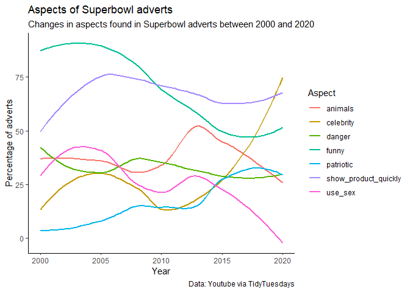

TidyTuesday 2021-03-03
================
02/03/2021

``` r
youtube %>%
  group_by(year) %>%
  summarize(across(where(is.logical), sum),
            n = n()) %>%
  mutate(across(funny:use_sex, function(x) x / n * 100, .names = "prop_{.col}")) -> props
```

    ## `summarise()` ungrouping output (override with `.groups` argument)

``` r
long <- props %>% 
  select(year, starts_with("prop_")) %>%
  pivot_longer(starts_with("prop_"), 
               names_to = "var", 
               names_prefix = "prop_") 
```

``` r
long %>% 
  ggplot(aes(x = year, y = value, col = factor(var))) +
  # geom_line() + 
  geom_smooth(se = FALSE) + 
  theme_classic() +
  labs(col = "Aspect",
       title = "Aspects of Superbowl adverts",
       x = "Year",
       y = "Percentage of adverts",
       subtitle = "Changes in aspects found in Superbowl adverts between 2000 and 2020",
       caption = "Data: Youtube via TidyTuesdays")
```

    ## `geom_smooth()` using method = 'loess' and formula 'y ~ x'

<!-- -->
