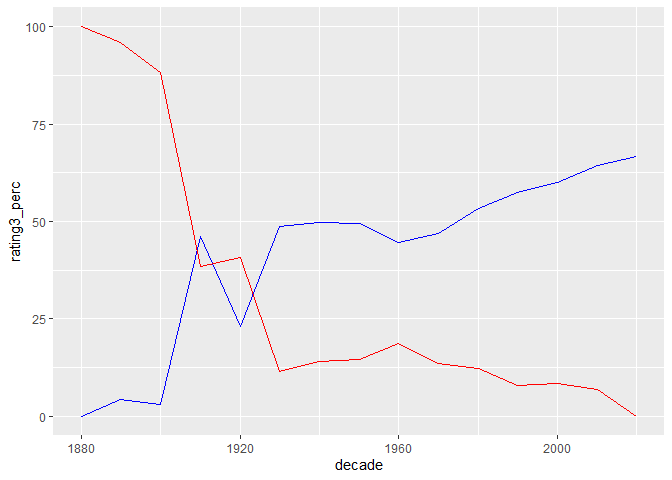
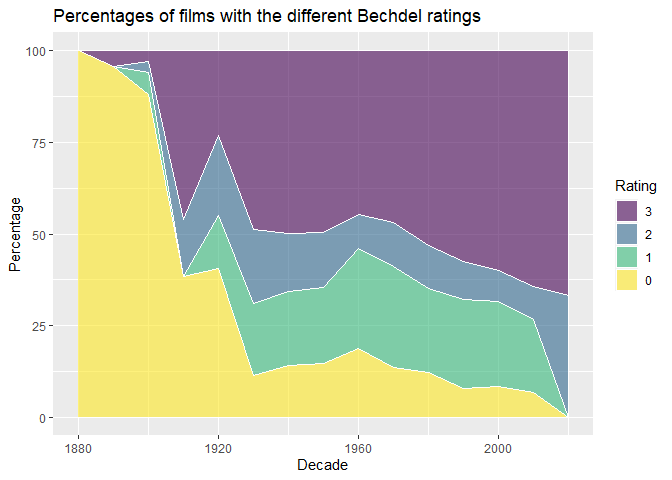

TidyTuesday 2021-03-03
================
09/03/2021

``` r
head(movies)
```

    ## # A tibble: 6 x 34
    ##    year imdb  title test  clean_test binary budget domgross intgross code 
    ##   <dbl> <chr> <chr> <chr> <chr>      <chr>   <dbl> <chr>    <chr>    <chr>
    ## 1  2013 tt17~ 21 &~ nota~ notalk     FAIL   1.30e7 25682380 42195766 2013~
    ## 2  2012 tt13~ Dred~ ok-d~ ok         PASS   4.50e7 13414714 40868994 2012~
    ## 3  2013 tt20~ 12 Y~ nota~ notalk     FAIL   2.00e7 53107035 1586070~ 2013~
    ## 4  2013 tt12~ 2 Gu~ nota~ notalk     FAIL   6.10e7 75612460 1324930~ 2013~
    ## 5  2013 tt04~ 42    men   men        FAIL   4.00e7 95020213 95020213 2013~
    ## 6  2013 tt13~ 47 R~ men   men        FAIL   2.25e8 38362475 1458038~ 2013~
    ## # ... with 24 more variables: budget_2013 <dbl>, domgross_2013 <chr>,
    ## #   intgross_2013 <chr>, period_code <dbl>, decade_code <dbl>, imdb_id <chr>,
    ## #   plot <chr>, rated <chr>, response <lgl>, language <chr>, country <chr>,
    ## #   writer <chr>, metascore <dbl>, imdb_rating <dbl>, director <chr>,
    ## #   released <chr>, actors <chr>, genre <chr>, awards <chr>, runtime <chr>,
    ## #   type <chr>, poster <chr>, imdb_votes <dbl>, error <lgl>

``` r
head(raw_bechdel)
```

    ## # A tibble: 6 x 5
    ##    year    id imdb_id title                                 rating
    ##   <dbl> <dbl> <chr>   <chr>                                  <dbl>
    ## 1  1888  8040 0392728 Roundhay Garden Scene                      0
    ## 2  1892  5433 0000003 Pauvre Pierrot                             0
    ## 3  1895  6200 0132134 The Execution of Mary, Queen of Scots      0
    ## 4  1895  5444 0000014 Tables Turned on the Gardener              0
    ## 5  1896  5406 0000131 Une nuit terrible                          0
    ## 6  1896  5445 0223341 La fee aux choux                           0

``` r
bechdel <- raw_bechdel %>%
  mutate(decade = cut(year, seq(1880, 2030, 10), label = seq(1880, 2020, 10))) %>%
  group_by(decade) %>%
  summarize(rating0 = sum(rating == 0),
         rating1 = sum(rating == 1),
         rating2 = sum(rating == 2), 
         rating3 = sum(rating == 3),
         N = n()) %>%
  mutate(across(rating0:rating3, function(x) x/N*100, .names = "{.col}_perc"),
         decade = as.numeric(as.character(decade))) 
```

    ## `summarise()` ungrouping output (override with `.groups` argument)

``` r
ggplot(bechdel, aes(x = decade, y = rating3_perc)) +
  geom_path(col = "blue") +
  geom_path(aes(x = decade, y = rating0_perc), data = bechdel, col = "red")
```

<!-- -->

``` r
bechdel %>%
  pivot_longer(ends_with("perc"), names_to = "group") %>%
  mutate(group = factor(group, 
                        levels = paste0("rating", 0:3, "_perc"), 0:3)) %>%
  ggplot(aes(x = decade, y = value, fill = forcats::fct_rev(group))) +
  geom_area(alpha=0.6 , size=.5, colour="white") +
  viridis::scale_fill_viridis(discrete = T) +
  labs(x = "Decade",
       y = "Percentage",
       title = "Percentages of films with the different Bechdel ratings",
       fill = "Rating")
```

<!-- -->
