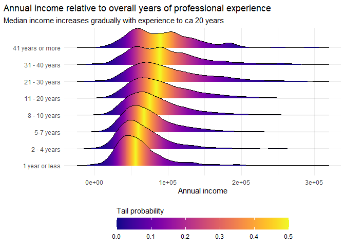
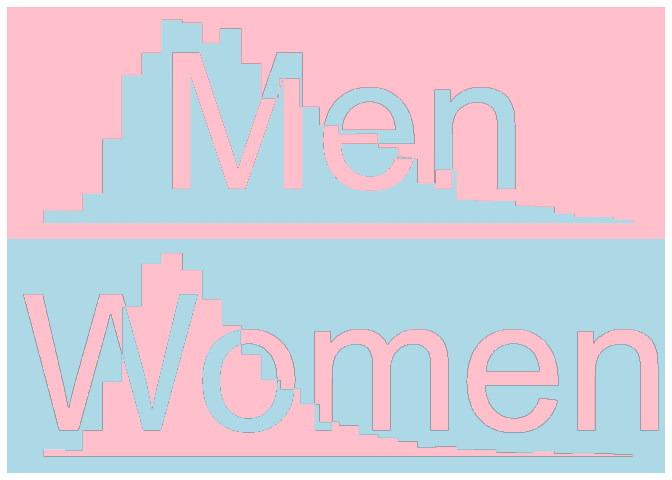

TidyTemplate
================
2021-05-19

# TidyTuesday

Join the R4DS Online Learning Community in the weekly \#TidyTuesday
event! Every week we post a raw dataset, a chart or article related to
that dataset, and ask you to explore the data. While the dataset will be
“tamed”, it will not always be tidy! As such you might need to apply
various R for Data Science techniques to wrangle the data into a true
tidy format. The goal of TidyTuesday is to apply your R skills, get
feedback, explore other’s work, and connect with the greater \#RStats
community! As such we encourage everyone of all skills to participate!

# Load the weekly Data

Dowload the weekly data and make available in the `tt` object.

``` r
tt <- tt_load("2021-05-18")
```

    ## --- Compiling #TidyTuesday Information for 2021-05-18 ----

    ## --- There is 1 file available ---

    ## --- Starting Download ---

    ## 
    ##  Downloading file 1 of 1: `survey.csv`

    ## --- Download complete ---

# Readme

Take a look at the readme for the weekly data to get insight on the
dataset. This includes a data dictionary, source, and a link to an
article on the data.

``` r
tt
```

# Glimpse Data

Take an initial look at the format of the data available.

``` r
glimpse(tt$survey)
```

    ## Rows: 26,232
    ## Columns: 18
    ## $ timestamp                                <chr> "4/27/2021 11:02:10", "4/27/2~
    ## $ how_old_are_you                          <chr> "25-34", "25-34", "25-34", "2~
    ## $ industry                                 <chr> "Education (Higher Education)~
    ## $ job_title                                <chr> "Research and Instruction Lib~
    ## $ additional_context_on_job_title          <chr> NA, NA, NA, NA, NA, NA, NA, "~
    ## $ annual_salary                            <dbl> 55000, 54600, 34000, 62000, 6~
    ## $ other_monetary_comp                      <chr> "0", "4000", NA, "3000", "700~
    ## $ currency                                 <chr> "USD", "GBP", "USD", "USD", "~
    ## $ currency_other                           <chr> NA, NA, NA, NA, NA, NA, NA, N~
    ## $ additional_context_on_income             <chr> NA, NA, NA, NA, NA, NA, NA, N~
    ## $ country                                  <chr> "United States", "United King~
    ## $ state                                    <chr> "Massachusetts", NA, "Tenness~
    ## $ city                                     <chr> "Boston", "Cambridge", "Chatt~
    ## $ overall_years_of_professional_experience <chr> "5-7 years", "8 - 10 years", ~
    ## $ years_of_experience_in_field             <chr> "5-7 years", "5-7 years", "2 ~
    ## $ highest_level_of_education_completed     <chr> "Master's degree", "College d~
    ## $ gender                                   <chr> "Woman", "Non-binary", "Woman~
    ## $ race                                     <chr> "White", "White", "White", "W~

``` r
surv <- tt$survey

# table(surv$industry)
# length(unique(surv$industry))
# 
# table(surv$how_old_are_you)
# table(surv$years_of_experience_in_field)
```

# Wrangle

Explore the data and process it into a nice format for plotting! Access
each dataset by name by using a dollarsign after the `tt` object and
then the name of the data set.

``` r
ylev <- c("1 year or less", "2 - 4 years", "5-7 years", "8 - 10 years", "11 - 20 years",
  "21 - 30 years", "31 - 40 years", "41 years or more")


dat <- surv %>%
  filter(annual_salary < 300000) %>%
  mutate(years_of_experience_in_field = factor(years_of_experience_in_field,
                                               ylev, ylev),
         overall_years_of_professional_experience = factor(overall_years_of_professional_experience,
                                               ylev, ylev))
```

# Visualize

Using your processed dataset, create your unique visualization.

``` r
library(ggplot2)
library(ggridges)
library(viridis)
```

    ## Lade nötiges Paket: viridisLite

``` r
p1 <- dat %>%
  ggplot(aes(x = annual_salary, y = years_of_experience_in_field, 
             fill = 0.5 - abs(0.5 - stat(ecdf)))) +
  # geom_histogram() +
  # geom_density_ridges_gradient(draw_baseline = FALSE) +
  # stat_summary(fun = range) +
  stat_density_ridges(
    geom = "density_ridges_gradient",
    calc_ecdf = TRUE#,
    # quantiles = c(0.025, 0.975)
  ) +
  scale_fill_viridis(name = "Tail probability", option = "C", limits = c(0,.5)) +
  theme_test() +
  xlab("Annual income") +
  ylab("") +
  labs(title = "Annual income relative to years of experience in field",
       subtitle = "Median income increases gradually with experience to ca 20 years") +
  theme(plot.title.position = "plot", legend.position = "bottom") +
  guides(fill = guide_colorbar(title.position = "top",
                               barwidth = unit(.5, "npc"),
                               title = "Tail probability", 
                               draw.ulim = TRUE), 
         colour = "white")

p2 <- dat %>%
  ggplot(aes(x = annual_salary, y = overall_years_of_professional_experience, 
             fill = 0.5 - abs(0.5 - stat(ecdf)))) +
  # geom_histogram() +
  # geom_density_ridges_gradient(draw_baseline = FALSE) +
  # stat_summary(fun = range) +
  stat_density_ridges(
    geom = "density_ridges_gradient",
    calc_ecdf = TRUE#,
    # quantiles = c(0.025, 0.975)
  ) +
  scale_fill_viridis(name = "Tail probability", option = "C", limits = c(0,.5)) +
  theme_minimal() +
  xlab("Annual income") +
  ylab("") +
  labs(title = "Annual income relative to overall years of professional experience",
       subtitle = "Median income increases gradually with experience to ca 20 years") +
  theme(plot.title.position = "plot", legend.position = "bottom") +
  guides(fill = guide_colorbar(title.position = "top",
                               barwidth = unit(.5, "npc"),
                               title = "Tail probability", 
                               draw.ulim = TRUE), 
         colour = "white")


p2
```

    ## Picking joint bandwidth of 8040

<!-- -->

``` r
library(ggfx)

cols <- c("lightblue", "pink")

m <- dat %>%
  filter(gender %in% c("Man")) %>%
  ggplot(aes(x = annual_salary)) +
  as_reference(
    geom_histogram(fill = cols[1], col = cols[1]),
    id = "hist") +
  with_blend(
    geom_text(aes(x = 150000, y = 200, label = "Men"), col = cols[1], size = 50),
    bg_layer = "hist",
    blend_type = "xor"
    ) +
  theme_minimal() +
  theme(plot.background = element_rect(fill = cols[2], colour = cols[2]),
        panel.background = element_rect(fill = cols[2], colour = cols[2]),
        axis.line = element_blank(),
        axis.text = element_blank(),
        axis.title = element_blank(),
        axis.ticks = element_blank(),
        panel.grid = element_blank(), 
        panel.border = element_blank(), 
        plot.margin = unit(c(1,1,1,1), "mm"))


cols <- rev(cols)

f <- dat %>%
  filter(gender %in% c("Woman")) %>%
  ggplot(aes(x = annual_salary)) +
  as_reference(
    geom_histogram(fill = cols[1], col = cols[1]),
    id = "hist") +
  with_blend(
    geom_text(aes(x = 150000, y = 1200, label = "Women"), col = cols[1], size = 50),
    bg_layer = "hist",
    blend_type = "xor"
    ) +
  theme_minimal() +
  theme(plot.background = element_rect(fill = cols[2], colour = cols[2]),
        panel.background = element_rect(fill = cols[2], colour = cols[2]),
        axis.line = element_blank(),
        axis.text = element_blank(),
        axis.title = element_blank(),
        axis.ticks = element_blank(),
        panel.grid = element_blank(), 
        panel.border = element_blank(), 
        plot.margin = unit(c(1,1,1,1), "mm"))


library(patchwork)

m / f
```

    ## `stat_bin()` using `bins = 30`. Pick better value with `binwidth`.

    ## `stat_bin()` using `bins = 30`. Pick better value with `binwidth`.

<!-- -->

# Save Image

Save your image for sharing. Be sure to use the `#TidyTuesday` hashtag
in your post on twitter!

``` r
# This will save your most recent plot
ggsave(
  filename = "income.png",
  device = "png")
```

    ## Saving 7 x 5 in image

    ## `stat_bin()` using `bins = 30`. Pick better value with `binwidth`.
    ## `stat_bin()` using `bins = 30`. Pick better value with `binwidth`.
