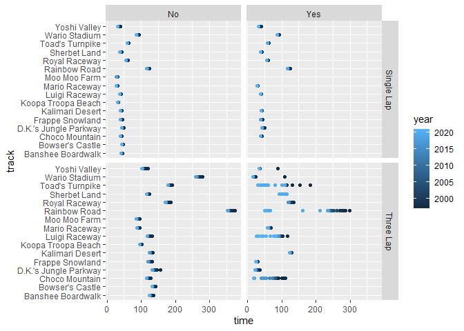
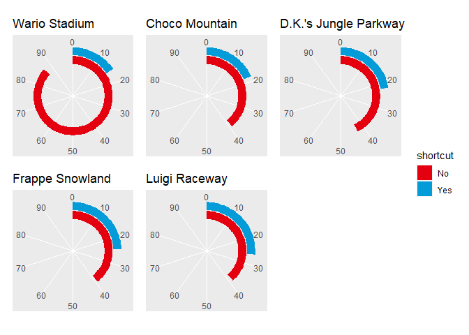

TidyTemplate
================
2021-05-25

# TidyTuesday

Join the R4DS Online Learning Community in the weekly \#TidyTuesday
event! Every week we post a raw dataset, a chart or article related to
that dataset, and ask you to explore the data. While the dataset will be
“tamed”, it will not always be tidy! As such you might need to apply
various R for Data Science techniques to wrangle the data into a true
tidy format. The goal of TidyTuesday is to apply your R skills, get
feedback, explore other’s work, and connect with the greater \#RStats
community! As such we encourage everyone of all skills to participate!

# Load the weekly Data

Dowload the weekly data and make available in the `tt` object.

``` r
tt <- tt_load("2021-05-25")
```

    ## --- Compiling #TidyTuesday Information for 2021-05-25 ----

    ## --- There are 2 files available ---

    ## --- Starting Download ---

    ## 
    ##  Downloading file 1 of 2: `drivers.csv`
    ##  Downloading file 2 of 2: `records.csv`

    ## --- Download complete ---

# Readme

Take a look at the readme for the weekly data to get insight on the
dataset. This includes a data dictionary, source, and a link to an
article on the data.

``` r
tt
```

# Glimpse Data

Take an initial look at the format of the data available.

``` r
tt %>% 
  map(glimpse)
```

    ## Rows: 2,250
    ## Columns: 6
    ## $ position <dbl> 1, 1, 1, 1, 1, 1, 1, 1, 1, 1, 1, 1, 1, 1, 1, 1, 1, 1, 1, 1, 1~
    ## $ player   <chr> "Penev", "Penev", "Penev", "Penev", "Penev", "Penev", "Penev"~
    ## $ total    <dbl> 344, 344, 344, 344, 344, 344, 344, 344, 344, 344, 344, 344, 3~
    ## $ year     <dbl> 1997, 1998, 1999, 2000, 2001, 2002, 2003, 2004, 2005, 2006, 2~
    ## $ records  <dbl> NA, 181, 126, 14, 5, 11, 2, 5, NA, NA, NA, NA, NA, NA, NA, NA~
    ## $ nation   <chr> "Australia", "Australia", "Australia", "Australia", "Australi~
    ## Rows: 2,334
    ## Columns: 9
    ## $ track           <chr> "Luigi Raceway", "Luigi Raceway", "Luigi Raceway", "Lu~
    ## $ type            <chr> "Three Lap", "Three Lap", "Three Lap", "Three Lap", "T~
    ## $ shortcut        <chr> "No", "No", "No", "No", "No", "No", "No", "No", "No", ~
    ## $ player          <chr> "Salam", "Booth", "Salam", "Salam", "Gregg G", "Rocky ~
    ## $ system_played   <chr> "NTSC", "NTSC", "NTSC", "NTSC", "NTSC", "NTSC", "NTSC"~
    ## $ date            <date> 1997-02-15, 1997-02-16, 1997-02-16, 1997-02-28, 1997-~
    ## $ time_period     <chr> "2M 12.99S", "2M 9.99S", "2M 8.99S", "2M 6.99S", "2M 4~
    ## $ time            <dbl> 132.99, 129.99, 128.99, 126.99, 124.51, 122.89, 122.87~
    ## $ record_duration <dbl> 1, 0, 12, 7, 54, 0, 0, 27, 0, 64, 3, 0, 90, 132, 1, 74~

    ## $drivers
    ## # A tibble: 2,250 x 6
    ##    position player total  year records nation   
    ##       <dbl> <chr>  <dbl> <dbl>   <dbl> <chr>    
    ##  1        1 Penev    344  1997      NA Australia
    ##  2        1 Penev    344  1998     181 Australia
    ##  3        1 Penev    344  1999     126 Australia
    ##  4        1 Penev    344  2000      14 Australia
    ##  5        1 Penev    344  2001       5 Australia
    ##  6        1 Penev    344  2002      11 Australia
    ##  7        1 Penev    344  2003       2 Australia
    ##  8        1 Penev    344  2004       5 Australia
    ##  9        1 Penev    344  2005      NA Australia
    ## 10        1 Penev    344  2006      NA Australia
    ## # ... with 2,240 more rows
    ## 
    ## $records
    ## # A tibble: 2,334 x 9
    ##    track     type    shortcut player  system_played date       time_period  time
    ##    <chr>     <chr>   <chr>    <chr>   <chr>         <date>     <chr>       <dbl>
    ##  1 Luigi Ra~ Three ~ No       Salam   NTSC          1997-02-15 2M 12.99S    133.
    ##  2 Luigi Ra~ Three ~ No       Booth   NTSC          1997-02-16 2M 9.99S     130.
    ##  3 Luigi Ra~ Three ~ No       Salam   NTSC          1997-02-16 2M 8.99S     129.
    ##  4 Luigi Ra~ Three ~ No       Salam   NTSC          1997-02-28 2M 6.99S     127.
    ##  5 Luigi Ra~ Three ~ No       Gregg G NTSC          1997-03-07 2M 4.51S     125.
    ##  6 Luigi Ra~ Three ~ No       Rocky G NTSC          1997-04-30 2M 2.89S     123.
    ##  7 Luigi Ra~ Three ~ No       Launsp~ NTSC          1997-04-30 2M 2.87S     123.
    ##  8 Luigi Ra~ Three ~ No       Launsp~ NTSC          1997-04-30 2M 2.78S     123.
    ##  9 Luigi Ra~ Three ~ No       Launsp~ NTSC          1997-05-27 2M 2.25S     122.
    ## 10 Luigi Ra~ Three ~ No       Launsp~ NTSC          1997-05-27 2M 2.21S     122.
    ## # ... with 2,324 more rows, and 1 more variable: record_duration <dbl>

# Wrangle

Explore the data and process it into a nice format for plotting! Access
each dataset by name by using a dollarsign after the `tt` object and
then the name of the data set.

``` r
dat <- tt$records %>%
  group_by(track) %>% 
  mutate(year = lubridate::year(date))

dat %>% 
  ggplot(aes(x = time, y = track, col = year)) +
  geom_point() +
  facet_grid(type ~ shortcut)
```

<!-- -->

``` r
dat <- dat %>%
  group_by(track, shortcut) %>% 
  summarize(min_time = min(time)) %>%
  group_by(track) %>% 
  mutate(shortcut = factor(shortcut),
         m = min(min_time)) %>%
  ungroup() %>% 
  arrange(m) %>% 
  slice(1:10)
```

    ## `summarise()` has grouped output by 'track'. You can override using the `.groups` argument.

# Visualize

Using your processed dataset, create your unique visualization.

``` r
remotes::install_github("jrcalabrese/joycon")
```

    ## Skipping install of 'joycon' from a github remote, the SHA1 (4bc3ee38) has not changed since last install.
    ##   Use `force = TRUE` to force installation

``` r
library(joycon)
library(patchwork)
```

    ## Warning: package 'patchwork' was built under R version 4.0.5

``` r
library(extrafont)
```

    ## Warning: package 'extrafont' was built under R version 4.0.3

    ## Registering fonts with R

``` r
smcol <- joycon_pal("SuperMario", 2)

max <- ceiling(max(dat$min_time)/10)*10

map(unique(dat$track), ~ 
dat %>% 
  filter(track == .x) %>% 
  ggplot(aes(x = min_time + 1, y = shortcut, fill = shortcut)) +
  geom_bar(stat = "identity"
           # , width = .25
           ) +
  # xlim(0, max) +
  scale_y_discrete(limits = c("", "", "", "", "No", "Yes"), 
                   breaks = c("", "", "", "", "No", "Yes"), 
                   drop = FALSE) +
  scale_x_continuous(breaks = seq(0, max, 10), limits = c(0,100)) +
  scale_fill_discrete(type = smcol, drop = FALSE) +
  theme(panel.grid.major.y = element_blank(),
        panel.grid.minor.y = element_blank(),
        panel.grid.minor.x = element_blank(),
        axis.title.y = element_blank(),
        axis.title.x = element_blank(),
        axis.text.y = element_blank(),
        axis.ticks.y = element_blank(),
        title = element_text(family="SuperMario256")
        ) +
  ggtitle(.x) +
  coord_polar()
) %>% 
  wrap_plots() + 
  plot_layout(guides = "collect")
```

    ## Warning in grid.Call(C_stringMetric, as.graphicsAnnot(x$label)): font family not
    ## found in Windows font database

    ## Warning in grid.Call(C_stringMetric, as.graphicsAnnot(x$label)): font family not
    ## found in Windows font database

    ## Warning in grid.Call(C_textBounds, as.graphicsAnnot(x$label), x$x, x$y, : font
    ## family not found in Windows font database

    ## Warning in grid.Call(C_textBounds, as.graphicsAnnot(x$label), x$x, x$y, : font
    ## family not found in Windows font database

    ## Warning in grid.Call(C_textBounds, as.graphicsAnnot(x$label), x$x, x$y, : font
    ## family not found in Windows font database

    ## Warning in grid.Call(C_textBounds, as.graphicsAnnot(x$label), x$x, x$y, : font
    ## family not found in Windows font database

    ## Warning in grid.Call(C_textBounds, as.graphicsAnnot(x$label), x$x, x$y, : font
    ## family not found in Windows font database

    ## Warning in grid.Call(C_textBounds, as.graphicsAnnot(x$label), x$x, x$y, : font
    ## family not found in Windows font database

    ## Warning in grid.Call(C_textBounds, as.graphicsAnnot(x$label), x$x, x$y, : font
    ## family not found in Windows font database

    ## Warning in grid.Call(C_textBounds, as.graphicsAnnot(x$label), x$x, x$y, : font
    ## family not found in Windows font database

    ## Warning in grid.Call(C_textBounds, as.graphicsAnnot(x$label), x$x, x$y, : font
    ## family not found in Windows font database

    ## Warning in grid.Call(C_textBounds, as.graphicsAnnot(x$label), x$x, x$y, : font
    ## family not found in Windows font database

    ## Warning in grid.Call(C_textBounds, as.graphicsAnnot(x$label), x$x, x$y, : font
    ## family not found in Windows font database

    ## Warning in grid.Call(C_textBounds, as.graphicsAnnot(x$label), x$x, x$y, : font
    ## family not found in Windows font database

    ## Warning in grid.Call(C_textBounds, as.graphicsAnnot(x$label), x$x, x$y, : font
    ## family not found in Windows font database

    ## Warning in grid.Call(C_textBounds, as.graphicsAnnot(x$label), x$x, x$y, : font
    ## family not found in Windows font database

    ## Warning in grid.Call(C_textBounds, as.graphicsAnnot(x$label), x$x, x$y, : font
    ## family not found in Windows font database

<!-- -->

# Save Image

Save your image for sharing. Be sure to use the `#TidyTuesday` hashtag
in your post on twitter!

``` r
# This will save your most recent plot
ggsave(
  filename = "My TidyTuesday Plot.png",
  device = "png")
```

    ## Saving 7 x 5 in image

    ## Warning in grid.Call(C_textBounds, as.graphicsAnnot(x$label), x$x, x$y, : font
    ## family not found in Windows font database

    ## Warning in grid.Call(C_textBounds, as.graphicsAnnot(x$label), x$x, x$y, : font
    ## family not found in Windows font database

    ## Warning in grid.Call(C_textBounds, as.graphicsAnnot(x$label), x$x, x$y, : font
    ## family not found in Windows font database

    ## Warning in grid.Call(C_textBounds, as.graphicsAnnot(x$label), x$x, x$y, : font
    ## family not found in Windows font database

    ## Warning in grid.Call(C_textBounds, as.graphicsAnnot(x$label), x$x, x$y, : font
    ## family not found in Windows font database

    ## Warning in grid.Call(C_textBounds, as.graphicsAnnot(x$label), x$x, x$y, : font
    ## family not found in Windows font database

    ## Warning in grid.Call(C_textBounds, as.graphicsAnnot(x$label), x$x, x$y, : font
    ## family not found in Windows font database

    ## Warning in grid.Call(C_textBounds, as.graphicsAnnot(x$label), x$x, x$y, : font
    ## family not found in Windows font database

    ## Warning in grid.Call(C_textBounds, as.graphicsAnnot(x$label), x$x, x$y, : font
    ## family not found in Windows font database

    ## Warning in grid.Call(C_textBounds, as.graphicsAnnot(x$label), x$x, x$y, : font
    ## family not found in Windows font database

    ## Warning in grid.Call(C_textBounds, as.graphicsAnnot(x$label), x$x, x$y, : font
    ## family not found in Windows font database

    ## Warning in grid.Call(C_textBounds, as.graphicsAnnot(x$label), x$x, x$y, : font
    ## family not found in Windows font database

    ## Warning in grid.Call(C_textBounds, as.graphicsAnnot(x$label), x$x, x$y, : font
    ## family not found in Windows font database

    ## Warning in grid.Call(C_textBounds, as.graphicsAnnot(x$label), x$x, x$y, : font
    ## family not found in Windows font database

    ## Warning in grid.Call(C_textBounds, as.graphicsAnnot(x$label), x$x, x$y, : font
    ## family not found in Windows font database

    ## Warning in grid.Call(C_textBounds, as.graphicsAnnot(x$label), x$x, x$y, : font
    ## family not found in Windows font database
