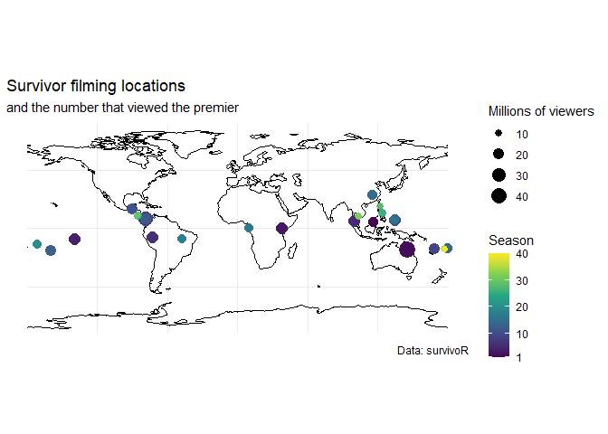
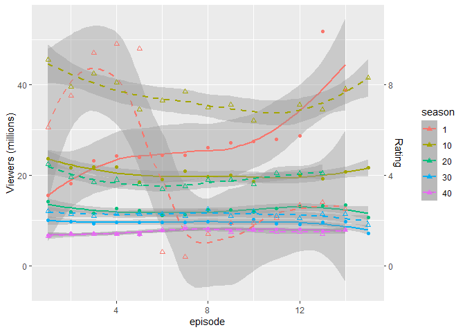
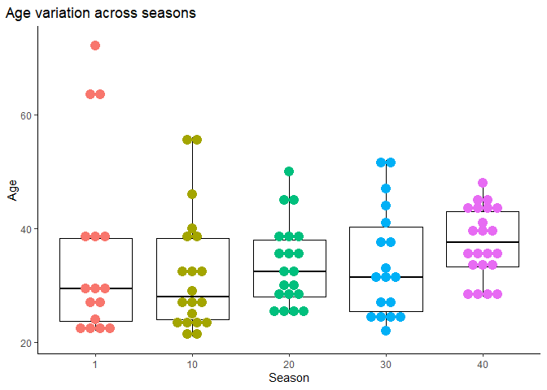

TidyTemplate
================
2021-06-01

# TidyTuesday

Join the R4DS Online Learning Community in the weekly \#TidyTuesday
event! Every week we post a raw dataset, a chart or article related to
that dataset, and ask you to explore the data. While the dataset will be
“tamed”, it will not always be tidy! As such you might need to apply
various R for Data Science techniques to wrangle the data into a true
tidy format. The goal of TidyTuesday is to apply your R skills, get
feedback, explore other’s work, and connect with the greater \#RStats
community! As such we encourage everyone of all skills to participate!

# Load the weekly Data

Dowload the weekly data and make available in the `tt` object.

``` r
# tt <- tt_load("2021-06-01")
summary <- readr::read_csv('https://raw.githubusercontent.com/rfordatascience/tidytuesday/master/data/2021/2021-06-01/summary.csv')
```

    ## 
    ## -- Column specification --------------------------------------------------------
    ## cols(
    ##   season_name = col_character(),
    ##   season = col_double(),
    ##   location = col_character(),
    ##   country = col_character(),
    ##   tribe_setup = col_character(),
    ##   full_name = col_character(),
    ##   winner = col_character(),
    ##   runner_ups = col_character(),
    ##   final_vote = col_character(),
    ##   timeslot = col_character(),
    ##   premiered = col_date(format = ""),
    ##   ended = col_date(format = ""),
    ##   filming_started = col_date(format = ""),
    ##   filming_ended = col_date(format = ""),
    ##   viewers_premier = col_double(),
    ##   viewers_finale = col_double(),
    ##   viewers_reunion = col_double(),
    ##   viewers_mean = col_double(),
    ##   rank = col_double()
    ## )

``` r
challenges <- readr::read_csv('https://raw.githubusercontent.com/rfordatascience/tidytuesday/master/data/2021/2021-06-01/challenges.csv')
```

    ## 
    ## -- Column specification --------------------------------------------------------
    ## cols(
    ##   season_name = col_character(),
    ##   season = col_double(),
    ##   episode = col_double(),
    ##   title = col_character(),
    ##   day = col_double(),
    ##   challenge_type = col_character(),
    ##   winners = col_character(),
    ##   winning_tribe = col_character()
    ## )

``` r
castaways <- readr::read_csv('https://raw.githubusercontent.com/rfordatascience/tidytuesday/master/data/2021/2021-06-01/castaways.csv')
```

    ## 
    ## -- Column specification --------------------------------------------------------
    ## cols(
    ##   season_name = col_character(),
    ##   season = col_double(),
    ##   full_name = col_character(),
    ##   castaway = col_character(),
    ##   age = col_double(),
    ##   city = col_character(),
    ##   state = col_character(),
    ##   personality_type = col_character(),
    ##   day = col_double(),
    ##   order = col_double(),
    ##   result = col_character(),
    ##   jury_status = col_character(),
    ##   original_tribe = col_character(),
    ##   swapped_tribe = col_character(),
    ##   swapped_tribe2 = col_character(),
    ##   merged_tribe = col_character(),
    ##   total_votes_received = col_double(),
    ##   immunity_idols_won = col_double()
    ## )

``` r
viewers <- readr::read_csv('https://raw.githubusercontent.com/rfordatascience/tidytuesday/master/data/2021/2021-06-01/viewers.csv')
```

    ## 
    ## -- Column specification --------------------------------------------------------
    ## cols(
    ##   season_name = col_character(),
    ##   season = col_double(),
    ##   episode_number_overall = col_double(),
    ##   episode = col_double(),
    ##   title = col_character(),
    ##   episode_date = col_date(format = ""),
    ##   viewers = col_double(),
    ##   rating_18_49 = col_double(),
    ##   share_18_49 = col_double()
    ## )

``` r
jury_votes <- readr::read_csv('https://raw.githubusercontent.com/rfordatascience/tidytuesday/master/data/2021/2021-06-01/jury_votes.csv')
```

    ## 
    ## -- Column specification --------------------------------------------------------
    ## cols(
    ##   season_name = col_character(),
    ##   season = col_double(),
    ##   castaway = col_character(),
    ##   finalist = col_character(),
    ##   vote = col_double()
    ## )

# Readme

Take a look at the readme for the weekly data to get insight on the
dataset. This includes a data dictionary, source, and a link to an
article on the data.

# Glimpse Data

Take an initial look at the format of the data available.

``` r
for(i in ls()){
  print(i)
  tmp <- get(i)
  glimpse(tmp)
}
```

    ## [1] "castaways"
    ## Rows: 744
    ## Columns: 18
    ## $ season_name          <chr> "Survivor: Winners at War", "Survivor: Winners at~
    ## $ season               <dbl> 40, 40, 40, 40, 40, 40, 40, 40, 40, 40, 40, 40, 4~
    ## $ full_name            <chr> "Natalie Anderson", "Amber Mariano", "Danni Boatw~
    ## $ castaway             <chr> "Natalie", "Amber", "Danni", "Ethan", "Tyson", "R~
    ## $ age                  <dbl> 33, 40, 43, 45, 39, 43, 36, 44, 44, 35, 28, 39, 2~
    ## $ city                 <chr> "Edgewater", "Pensacola", "Shawnee", "Hillsboroug~
    ## $ state                <chr> "New Jersey", "Florida", "Kansas", "New Hampshire~
    ## $ personality_type     <chr> "ESTP", "ISFP", "ENFJ", "ISFP", "ESTP", "ESTJ", "~
    ## $ day                  <dbl> 2, 3, 6, 9, 11, 14, 16, 16, 18, 21, 23, 25, 28, 2~
    ## $ order                <dbl> 1, 2, 3, 4, 5, 6, 7, 8, 9, 10, 11, 12, 13, 14, 15~
    ## $ result               <chr> "1st voted out", "2nd voted out", "3rd voted out"~
    ## $ jury_status          <chr> NA, "1st jury member", "2nd jury member", "3rd ju~
    ## $ original_tribe       <chr> "Sele", "Dakal", "Sele", "Sele", "Dakal", "Sele",~
    ## $ swapped_tribe        <chr> NA, NA, NA, NA, NA, "Yara", "Sele", "Dakal", "Sel~
    ## $ swapped_tribe2       <chr> NA, NA, NA, NA, NA, NA, NA, NA, NA, NA, NA, NA, N~
    ## $ merged_tribe         <chr> NA, NA, NA, NA, NA, NA, NA, NA, NA, "Koru", "Koru~
    ## $ total_votes_received <dbl> 11, 6, 8, 4, 12, 4, 8, 2, 3, 14, 15, 12, 6, 9, 9,~
    ## $ immunity_idols_won   <dbl> 1, 0, 0, 0, 0, 0, 0, 0, 0, 0, 0, 0, 0, 1, 1, 1, 2~
    ## [1] "challenges"
    ## Rows: 5,023
    ## Columns: 8
    ## $ season_name    <chr> "Survivor: Winners at War", "Survivor: Winners at War",~
    ## $ season         <dbl> 40, 40, 40, 40, 40, 40, 40, 40, 40, 40, 40, 40, 40, 40,~
    ## $ episode        <dbl> 1, 1, 1, 1, 1, 1, 1, 1, 1, 1, 1, 1, 1, 1, 1, 1, 1, 1, 1~
    ## $ title          <chr> "Greatest of the Greats", "Greatest of the Greats", "Gr~
    ## $ day            <dbl> 2, 2, 2, 2, 2, 2, 2, 2, 2, 2, 2, 2, 2, 2, 2, 2, 2, 2, 2~
    ## $ challenge_type <chr> "reward", "reward", "reward", "reward", "reward", "rewa~
    ## $ winners        <chr> "Amber", "Tyson", "Sandra", "Yul", "Wendell", "Sophie",~
    ## $ winning_tribe  <chr> "Dakal", "Dakal", "Dakal", "Dakal", "Dakal", "Dakal", "~
    ## [1] "jury_votes"
    ## Rows: 909
    ## Columns: 5
    ## $ season_name <chr> "Survivor: Winners at War", "Survivor: Winners at War", "S~
    ## $ season      <dbl> 40, 40, 40, 40, 40, 40, 40, 40, 40, 40, 40, 40, 40, 40, 40~
    ## $ castaway    <chr> "Sarah", "Sarah", "Sarah", "Ben", "Ben", "Ben", "Denise", ~
    ## $ finalist    <chr> "Michele", "Natalie", "Tony", "Michele", "Natalie", "Tony"~
    ## $ vote        <dbl> 0, 0, 1, 0, 0, 1, 0, 0, 1, 0, 0, 1, 0, 1, 0, 0, 0, 1, 0, 0~
    ## [1] "summary"
    ## Rows: 40
    ## Columns: 19
    ## $ season_name     <chr> "Survivor: Borneo", "Survivor: The Australian Outback"~
    ## $ season          <dbl> 1, 2, 3, 4, 5, 6, 7, 8, 9, 10, 11, 12, 13, 14, 15, 16,~
    ## $ location        <chr> "Pulau Tiga, Sabah, Malaysia", "Herbert River at Goshe~
    ## $ country         <chr> "Malaysia", "Australia", "Kenya", "Polynesia", "Thaila~
    ## $ tribe_setup     <chr> "Two tribes of eight new players", "Two tribes of eigh~
    ## $ full_name       <chr> "Richard Hatch", "Tina Wesson", "Ethan Zohn", "Vecepia~
    ## $ winner          <chr> "Richard", "Tina", "Ethan", "Vecepia", "Brian", "Jenna~
    ## $ runner_ups      <chr> "Kelly Wiglesworth", "Colby Donaldson", "Kim Johnson",~
    ## $ final_vote      <chr> "4-3", "4-3", "5-2", "4-3", "4-3", "6-1", "6-1", "4-3"~
    ## $ timeslot        <chr> "Wednesday 8:00 pm", "Thursday 8:00 pm", "Thursday 8:0~
    ## $ premiered       <date> 2000-05-31, 2001-01-28, 2001-10-11, 2002-02-28, 2002-~
    ## $ ended           <date> 2000-08-23, 2001-05-03, 2002-01-10, 2002-05-19, 2002-~
    ## $ filming_started <date> 2000-03-13, 2000-10-23, 2001-07-11, 2001-11-12, 2002-~
    ## $ filming_ended   <date> 2000-04-20, 2000-12-03, 2001-08-18, 2001-12-20, 2002-~
    ## $ viewers_premier <dbl> 15.51, 45.37, 23.84, 23.19, 23.05, 23.26, 21.50, 33.53~
    ## $ viewers_finale  <dbl> 51.69, 36.35, 27.26, 25.87, 24.08, 22.29, 25.23, 24.76~
    ## $ viewers_reunion <dbl> 36.70, 28.01, 19.05, 19.05, 20.43, 20.43, 21.87, 21.87~
    ## $ viewers_mean    <dbl> 28.30, 29.80, 20.69, 20.77, 21.21, 19.97, 20.72, 21.49~
    ## $ rank            <dbl> 2, 1, 8, 6, 4, 9, 7, 3, 10, 5, 8, 11, 13, 15, 8, 11, 1~
    ## [1] "viewers"
    ## Rows: 596
    ## Columns: 9
    ## $ season_name            <chr> "Survivor: Winners at War", "Survivor: Winners ~
    ## $ season                 <dbl> 40, 40, 40, 40, 40, 40, 40, 40, 40, 40, 40, 40,~
    ## $ episode_number_overall <dbl> 583, 584, 585, 586, 587, 588, 589, 590, 591, 59~
    ## $ episode                <dbl> 1, 2, 3, 4, 5, 6, 7, 8, 9, 10, 11, 12, 13, 14, ~
    ## $ title                  <chr> "Greatest of the Greats", "It's Like a Survivor~
    ## $ episode_date           <date> 2020-02-12, 2020-02-19, 2020-02-26, 2020-03-04~
    ## $ viewers                <dbl> 6.68, 7.16, 7.14, 7.08, 6.91, 7.83, 8.18, 8.23,~
    ## $ rating_18_49           <dbl> 1.3, 1.4, 1.4, 1.4, 1.4, 1.6, 1.7, 1.6, 1.5, 1.~
    ## $ share_18_49            <dbl> 7, 7, 7, 7, 6, 7, 8, 7, 6, 7, 6, 6, 5, 7, 6, 6,~

# Wrangle

Explore the data and process it into a nice format for plotting! Access
each dataset by name by using a dollarsign after the `tt` object and
then the name of the data set.

``` r
library(tidygeocoder)
coords <- geo(address = summary$location)
coords[2,] <- geo("Goshen Station, Queensland, Australia")
coords[11,] <- geo("Peten, Guatemala")
coords[14,] <- geo("Vanua Levu, Fiji")
coords[17,] <- geo("Estuaire, Gabon")
summary <- cbind(summary, coords)

library(sf)
```

    ## Warning: package 'sf' was built under R version 4.0.4

    ## Linking to GEOS 3.9.0, GDAL 3.2.1, PROJ 7.2.1

``` r
pts <- st_as_sf(summary, coords = c("long", "lat"), crs = 4326)

library(rnaturalearth)
```

    ## Warning: package 'rnaturalearth' was built under R version 4.0.5

``` r
library(ggmap)
```

    ## Warning: package 'ggmap' was built under R version 4.0.5

    ## Google's Terms of Service: https://cloud.google.com/maps-platform/terms/.

    ## Please cite ggmap if you use it! See citation("ggmap") for details.

    ## 
    ## Attaching package: 'ggmap'

    ## The following object is masked from 'package:tidygeocoder':
    ## 
    ##     geocode

``` r
sf <- ne_coastline() 
str(sf, 1)
```

    ## Formal class 'SpatialLinesDataFrame' [package "sp"] with 4 slots

``` r
sf_sf <- st_as_sf(sf)
```

# Visualize

Using your processed dataset, create your unique visualization.

``` r
library(ggplot2)

vf <- viewers %>%
  filter(season %in% c(1,10,20,30,40)) %>%
  mutate(season = factor(season)) %>% 
  ggplot(aes(x = episode, y = viewers, col = season)) +
  geom_smooth() +
  geom_smooth(mapping = aes(y = rating_18_49*5), lty = 2) +
  geom_point() +
  geom_point(mapping = aes(y = rating_18_49*5), pch = 2) +
  scale_y_continuous(
    # Features of the first axis
    name = "Viewers (millions)",
    # Add a second axis and specify its features
    sec.axis = sec_axis(~./5, name="Rating")
  )
  
cf <- castaways %>%
  filter(season %in% c(1,10,20,30,40)) %>%
  mutate(season = factor(season)) %>% 
  ggplot(aes(y = age, x = season, fill = season, col = season)) +
  geom_boxplot(fill = NA, col = "black", outlier.shape = NA) +
  geom_dotplot(binaxis = "y", stackdir = "center", ) +
  # stat_summary(geom = "point", fun = mean)
  theme_classic() +
  theme(plot.title.position = "plot",
        legend.position = "none") +
  labs(y = "Age", x = "Season",
       title = "Age variation across seasons") +
  guides(fill = NULL)


# 


mf <- ggplot(sf_sf) +
  geom_sf() +
  geom_sf(data = pts, 
          mapping = aes(col = season,
                        size = viewers_premier)) +
  scale_color_continuous(type = "viridis",
                               breaks = c(1,10,20,30,40), 
                               limits = c(1,40)) +
  theme_minimal() +
  # theme(legend.position = "bottom", 
  #       legend.box="vertical") +
  guides(col = guide_colourbar(title = "Season"#,
                               # barwidth = 20, 
                               # barheight = .5
                               )
         ) +
  labs(size = "Millions of viewers", 
       caption = "Data: survivoR",
       title = "Survivor filming locations",
       subtitle = "and the number that viewed the premier")
  
# library(patchwork)

mf
```

<!-- -->

``` r
vf
```

    ## `geom_smooth()` using method = 'loess' and formula 'y ~ x'

    ## Warning: Removed 1 rows containing non-finite values (stat_smooth).

    ## `geom_smooth()` using method = 'loess' and formula 'y ~ x'

    ## Warning: Removed 3 rows containing non-finite values (stat_smooth).

    ## Warning: Removed 1 rows containing missing values (geom_point).

    ## Warning: Removed 3 rows containing missing values (geom_point).

<!-- -->

``` r
cf
```

    ## `stat_bindot()` using `bins = 30`. Pick better value with `binwidth`.

<!-- -->

``` r
# (mf | (vf / cf ))
```

# Save Image

Save your image for sharing. Be sure to use the `#TidyTuesday` hashtag
in your post on twitter!

``` r
# This will save your most recent plot
ggsave(
  filename = "My TidyTuesday Plot.png",
  device = "png")
```

    ## Saving 7 x 5 in image

    ## `stat_bindot()` using `bins = 30`. Pick better value with `binwidth`.
