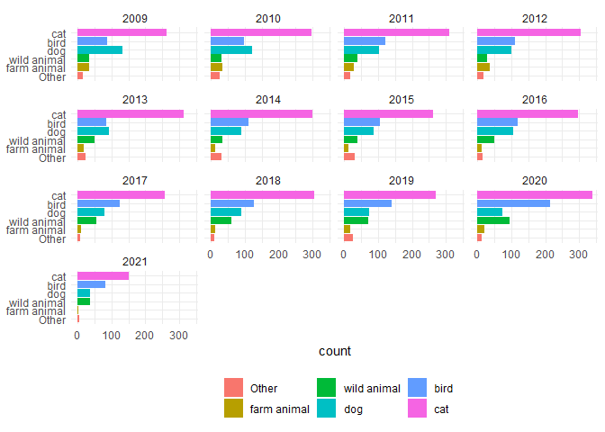
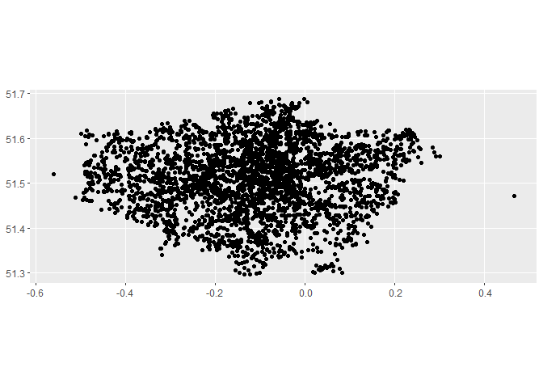
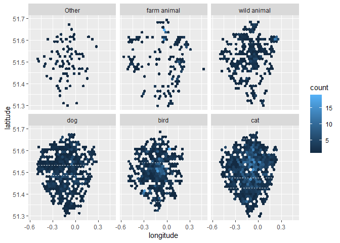
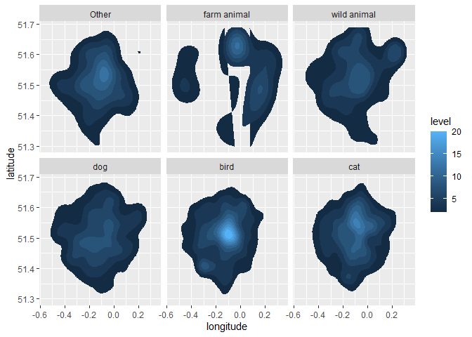
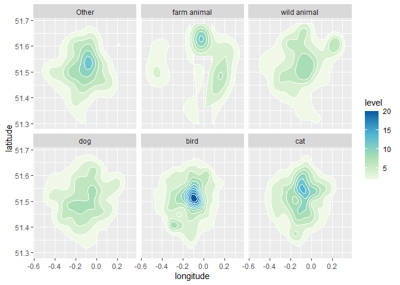
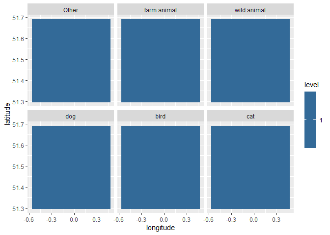

TidyTemplate
================
2021-06-29

# TidyTuesday

Join the R4DS Online Learning Community in the weekly \#TidyTuesday
event! Every week we post a raw dataset, a chart or article related to
that dataset, and ask you to explore the data. While the dataset will be
“tamed”, it will not always be tidy! As such you might need to apply
various R for Data Science techniques to wrangle the data into a true
tidy format. The goal of TidyTuesday is to apply your R skills, get
feedback, explore other’s work, and connect with the greater \#RStats
community! As such we encourage everyone of all skills to participate!

# Load the weekly Data

Dowload the weekly data and make available in the `tt` object.

``` r
tt <- tt_load("2021-06-29")
```

    ## --- Compiling #TidyTuesday Information for 2021-06-29 ----

    ## --- There is 1 file available ---

    ## --- Starting Download ---

    ## 
    ##  Downloading file 1 of 1: `animal_rescues.csv`

    ## --- Download complete ---

# Readme

Take a look at the readme for the weekly data to get insight on the
dataset. This includes a data dictionary, source, and a link to an
article on the data.

``` r
tt
```

# Glimpse Data

Take an initial look at the format of the data available.

``` r
tt %>% 
  map(glimpse)
```

    ## Rows: 7,544
    ## Columns: 31
    ## $ incident_number               <dbl> 139091, 275091, 2075091, 2872091, 355309~
    ## $ date_time_of_call             <chr> "01/01/2009 03:01", "01/01/2009 08:51", ~
    ## $ cal_year                      <dbl> 2009, 2009, 2009, 2009, 2009, 2009, 2009~
    ## $ fin_year                      <chr> "2008/09", "2008/09", "2008/09", "2008/0~
    ## $ type_of_incident              <chr> "Special Service", "Special Service", "S~
    ## $ pump_count                    <chr> "1", "1", "1", "1", "1", "1", "1", "1", ~
    ## $ pump_hours_total              <chr> "2", "1", "1", "1", "1", "1", "1", "1", ~
    ## $ hourly_notional_cost          <dbl> 255, 255, 255, 255, 255, 255, 255, 255, ~
    ## $ incident_notional_cost        <chr> "510", "255", "255", "255", "255", "255"~
    ## $ final_description             <chr> "Redacted", "Redacted", "Redacted", "Red~
    ## $ animal_group_parent           <chr> "Dog", "Fox", "Dog", "Horse", "Rabbit", ~
    ## $ originof_call                 <chr> "Person (land line)", "Person (land line~
    ## $ property_type                 <chr> "House - single occupancy", "Railings", ~
    ## $ property_category             <chr> "Dwelling", "Outdoor Structure", "Outdoo~
    ## $ special_service_type_category <chr> "Other animal assistance", "Other animal~
    ## $ special_service_type          <chr> "Animal assistance involving livestock -~
    ## $ ward_code                     <chr> "E05011467", "E05000169", "E05000558", "~
    ## $ ward                          <chr> "Crystal Palace & Upper Norwood", "Woods~
    ## $ borough_code                  <chr> "E09000008", "E09000008", "E09000029", "~
    ## $ borough                       <chr> "Croydon", "Croydon", "Sutton", "Hilling~
    ## $ stn_ground_name               <chr> "Norbury", "Woodside", "Wallington", "Ru~
    ## $ uprn                          <chr> "NULL", "NULL", "NULL", "1.00021E+11", "~
    ## $ street                        <chr> "Waddington Way", "Grasmere Road", "Mill~
    ## $ usrn                          <chr> "20500146", "NULL", "NULL", "21401484", ~
    ## $ postcode_district             <chr> "SE19", "SE25", "SM5", "UB9", "RM3", "RM~
    ## $ easting_m                     <chr> "NULL", "534785", "528041", "504689", "N~
    ## $ northing_m                    <chr> "NULL", "167546", "164923", "190685", "N~
    ## $ easting_rounded               <dbl> 532350, 534750, 528050, 504650, 554650, ~
    ## $ northing_rounded              <dbl> 170050, 167550, 164950, 190650, 192350, ~
    ## $ latitude                      <chr> "NULL", "51.39095371", "51.36894086", "5~
    ## $ longitude                     <chr> "NULL", "-0.064166887", "-0.161985191", ~

    ## $animal_rescues
    ## # A tibble: 7,544 x 31
    ##    incident_number date_time_of_call cal_year fin_year type_of_incident
    ##              <dbl> <chr>                <dbl> <chr>    <chr>           
    ##  1          139091 01/01/2009 03:01      2009 2008/09  Special Service 
    ##  2          275091 01/01/2009 08:51      2009 2008/09  Special Service 
    ##  3         2075091 04/01/2009 10:07      2009 2008/09  Special Service 
    ##  4         2872091 05/01/2009 12:27      2009 2008/09  Special Service 
    ##  5         3553091 06/01/2009 15:23      2009 2008/09  Special Service 
    ##  6         3742091 06/01/2009 19:30      2009 2008/09  Special Service 
    ##  7         4011091 07/01/2009 06:29      2009 2008/09  Special Service 
    ##  8         4211091 07/01/2009 11:55      2009 2008/09  Special Service 
    ##  9         4306091 07/01/2009 13:48      2009 2008/09  Special Service 
    ## 10         4715091 07/01/2009 21:24      2009 2008/09  Special Service 
    ## # ... with 7,534 more rows, and 26 more variables: pump_count <chr>,
    ## #   pump_hours_total <chr>, hourly_notional_cost <dbl>,
    ## #   incident_notional_cost <chr>, final_description <chr>,
    ## #   animal_group_parent <chr>, originof_call <chr>, property_type <chr>,
    ## #   property_category <chr>, special_service_type_category <chr>,
    ## #   special_service_type <chr>, ward_code <chr>, ward <chr>,
    ## #   borough_code <chr>, borough <chr>, stn_ground_name <chr>, uprn <chr>,
    ## #   street <chr>, usrn <chr>, postcode_district <chr>, easting_m <chr>,
    ## #   northing_m <chr>, easting_rounded <dbl>, northing_rounded <dbl>,
    ## #   latitude <chr>, longitude <chr>

# Wrangle

Explore the data and process it into a nice format for plotting! Access
each dataset by name by using a dollarsign after the `tt` object and
then the name of the data set.

``` r
dat <- tt$animal_rescues %>% 
  mutate(
    across(matches("^pump"), as.numeric),
    across(easting_m:longitude, as.numeric),
    animal_group_parent_o = animal_group_parent,
    animal_group_parent = tolower(animal_group_parent),
    animal_group_parent = case_when(
      animal_group_parent == "budgie" ~ "bird",
      animal_group_parent == "pigeon" ~ "bird",
      grepl("farm animal|sheep|livestock|horse|bull|lamb|cow|goat", animal_group_parent) ~ "farm animal",
      grepl("wild animal|squirrel|deer|fox", animal_group_parent) ~ "wild animal",
      TRUE ~ animal_group_parent),
    animal_group_parent = as.factor(animal_group_parent),
    animal_group_parent = fct_lump(animal_group_parent, n = 5)
    , animal_group_parent = fct_infreq(animal_group_parent)
    , animal_group_parent = fct_rev(animal_group_parent)
    )
```

    ## Warning in mask$eval_all_mutate(quo): NAs durch Umwandlung erzeugt

    ## Warning in mask$eval_all_mutate(quo): NAs durch Umwandlung erzeugt

    ## Warning in mask$eval_all_mutate(quo): NAs durch Umwandlung erzeugt

    ## Warning in mask$eval_all_mutate(quo): NAs durch Umwandlung erzeugt

    ## Warning in mask$eval_all_mutate(quo): NAs durch Umwandlung erzeugt

    ## Warning in mask$eval_all_mutate(quo): NAs durch Umwandlung erzeugt

``` r
dat %>% count(animal_group_parent, sort = TRUE)
```

    ## # A tibble: 6 x 2
    ##   animal_group_parent     n
    ##   <fct>               <int>
    ## 1 cat                  3666
    ## 2 bird                 1536
    ## 3 dog                  1194
    ## 4 wild animal           633
    ## 5 farm animal           265
    ## 6 Other                 250

``` r
dat %>% count(stn_ground_name, sort = TRUE)
```

    ## # A tibble: 107 x 2
    ##    stn_ground_name      n
    ##    <chr>            <int>
    ##  1 Enfield            136
    ##  2 Edmonton           132
    ##  3 Ilford             131
    ##  4 Tottenham          129
    ##  5 Dagenham           127
    ##  6 Hornsey            126
    ##  7 West Hampstead     120
    ##  8 North Kensington   116
    ##  9 Bethnal Green      113
    ## 10 Holloway           112
    ## # ... with 97 more rows

``` r
library(sf)
```

    ## Linking to GEOS 3.9.0, GDAL 3.2.1, PROJ 7.2.1

``` r
enfield <- dat %>% 
  filter(stn_ground_name == "Enfield") %>% 
  filter(!is.na(longitude)) %>% 
  filter(!is.na(latitude)) %>% 
  st_as_sf(coords = c("longitude", "latitude"))

library(osmdata)
```

    ## Data (c) OpenStreetMap contributors, ODbL 1.0. https://www.openstreetmap.org/copyright

``` r
bb <- st_bbox(enfield)
x <- bb %>% opq()

d1 <- x %>%
    add_osm_feature(key = 'highway') %>%
    osmdata_sf()
d2 <- x %>%
    add_osm_feature(key = 'railway') %>%
    osmdata_sf()
d3 <- x %>%
    add_osm_feature("water") %>%
    osmdata_sf()
d4 <- x %>%
    add_osm_feature("landuse", "forest") %>%
    osmdata_sf()
d5 <- x %>%
    add_osm_feature("natural", "wood") %>%
    osmdata_sf()
d6 <- x %>%
    add_osm_feature("landuse", "recreation_ground") %>%
    osmdata_sf()
d62 <- x %>%
    add_osm_feature("leasure", "park") %>%
    osmdata_sf()
d63 <- x %>%
    add_osm_feature("leasure", "nature_reserve") %>%
    osmdata_sf()
d64 <- x %>%
    add_osm_feature("leasure", "pitch") %>%
    osmdata_sf()
d7 <- x %>%
    add_osm_feature("landuse", "farmland") %>%
    osmdata_sf()
d8 <- x %>%
    add_osm_feature("landuse", "greenfield") %>%
    osmdata_sf()
```

# Visualize

Using your processed dataset, create your unique visualization.

``` r
dat %>% 
  group_by(cal_year) %>% 
  arrange() %>% 
  ggplot(aes(x = animal_group_parent, 
             fill = animal_group_parent)) +
  geom_bar() + 
  coord_flip() +
  theme_minimal() +
  theme(axis.title.y = element_blank(),
        legend.position = "bottom",
        legend.title = element_blank()) +
  facet_wrap(~ cal_year)
```

<!-- -->

``` r
# library(rnaturalearth)

# london <- rnaturalearth::ne_states("england")
# rnatural

dat2 <- dat %>% 
  filter(!is.na(longitude)) %>% 
  filter(!is.na(latitude)) %>% 
  filter(latitude > 50)

dat2 %>% 
  st_as_sf(coords = c("longitude", "latitude")) %>%
  ggplot() +
  geom_sf()
```

<!-- -->

``` r
  facet_wrap(~ animal_group_parent)
```

    ## <ggproto object: Class FacetWrap, Facet, gg>
    ##     compute_layout: function
    ##     draw_back: function
    ##     draw_front: function
    ##     draw_labels: function
    ##     draw_panels: function
    ##     finish_data: function
    ##     init_scales: function
    ##     map_data: function
    ##     params: list
    ##     setup_data: function
    ##     setup_params: function
    ##     shrink: TRUE
    ##     train_scales: function
    ##     vars: function
    ##     super:  <ggproto object: Class FacetWrap, Facet, gg>

``` r
dat2 %>% 
  ggplot(aes(x = longitude, y = latitude)) +
  geom_hex() +
  facet_wrap(~ animal_group_parent)
```

<!-- -->

``` r
dat2 %>% 
  ggplot(aes(x = longitude, y = latitude)) +
  stat_density_2d(aes(fill = ..level..), geom = "polygon") +
  facet_wrap(~ animal_group_parent)
```

<!-- -->

``` r
dat2 %>% 
  ggplot(aes(x = longitude, y = latitude)) +
  stat_density_2d(aes(fill = ..level..), geom = "polygon", colour="white") +
  scale_fill_distiller(palette=4, direction=1) +
  facet_wrap(~ animal_group_parent)
```

<!-- -->

``` r
dat2 %>% 
  ggplot(aes(x = longitude, y = latitude)) +
  stat_density_2d(aes(fill = ..level..), geom = "raster", contour = FALSE) +
  facet_wrap(~ animal_group_parent)
```

<!-- -->

``` r
# enfield
ggplot(d1$osm_lines) + geom_sf()
```

<!-- -->

``` r
st_crs(enfield) <- st_crs(d1$osm_lines)

enfield %>% 
  st_set_geometry(NULL) %>% 
  count(animal_group_parent)
```

    ## # A tibble: 6 x 2
    ##   animal_group_parent     n
    ##   <fct>               <int>
    ## 1 Other                   2
    ## 2 farm animal            23
    ## 3 wild animal            19
    ## 4 dog                    14
    ## 5 bird                    9
    ## 6 cat                    18

``` r
d1$osm_lines %>%
  ggplot() +
  geom_sf(data = d6$osm_polygons, fill = "lightgreen", col = NA, alpha = .6) +
  geom_sf(data = d62$osm_polygons, fill = "lightgreen", col = NA, alpha = .6) +
  geom_sf(data = d63$osm_polygons, fill = "lightgreen", col = NA, alpha = .6) +
  geom_sf(data = d64$osm_polygons, fill = "lightgreen", col = NA, alpha = .6) +
  geom_sf(data = d62$osm_multipolygons, fill = "lightgreen", col = NA, alpha = .6) +
  geom_sf(data = d63$osm_multipolygons, fill = "lightgreen", col = NA, alpha = .6) +
  geom_sf(data = d64$osm_multipolygons, fill = "lightgreen", col = NA, alpha = .6) +
  geom_sf(data = d8$osm_polygons, fill = "lightgreen", col = NA, alpha = .6) +
  geom_sf(data = d7$osm_polygons, fill = "brown", col = NA, alpha = .2) +
  geom_sf(data = d3$osm_polygons, fill = "lightblue", col = NA) +
  geom_sf(data = d4$osm_polygons, fill = "forestgreen", col = NA, alpha = .4) +
  geom_sf(data = d5$osm_polygons, fill = "forestgreen", col = NA, alpha = .4) +
  geom_sf(data = d2$osm_lines, col = "grey", lty = 2) +
  geom_sf(col = "grey") +
  geom_sf(data = enfield %>% filter(animal_group_parent == "cat"), 
          aes(col = animal_group_parent), 
          # pch = "🐱", size = 2
          ) +
  geom_sf(data = enfield %>% filter(animal_group_parent == "dog"), 
          aes(col = animal_group_parent), 
          # pch = "🐶", size = 2
          ) +
  geom_sf(data = enfield %>% filter(animal_group_parent == "bird"), 
          aes(col = animal_group_parent), 
          # pch = "🐦", size = 2
          ) +
  geom_sf(data = enfield %>% filter(animal_group_parent == "farm animal"), 
          aes(col = animal_group_parent), 
          # pch = "🐮", size = 2
          ) +
  geom_sf(data = enfield %>% filter(animal_group_parent == "wild animal"), 
          aes(col = animal_group_parent), 
          # pch = "🦊", size = 2
          ) +
  geom_point(aes(y = 51.66023500475344, x = -0.05204266969224151), size = 3
             # , pch = "🚒"
             ) + 
  coord_sf(ylim=c(bb$ymin, bb$ymax),
           xlim = c(bb$xmin, bb$xmax)) +
  scale_color_discrete(name = "", labels = c("Birds", "Cats", "Dogs", "Livestock", "Wild animals")) +
  guides(color = guide_legend(
    override.aes = list(size = 3#,
                        # pch = c("🐦", "🐱", "🐶", "🐮", "🦊")
                        )
    ) 
  ) +
  theme(legend.position = "bottom",
        plot.background = element_rect(fill = "#faebd750"),
        panel.background = element_blank(),
        axis.title = element_blank()
        , legend.background = element_blank()
        , legend.key = element_blank()
        , plot.title.position = "plot"
        ) +
  ggtitle("Animals rescued by Enfield Fire Station 2009-2021")
```

<!-- -->

# Save Image

Save your image for sharing. Be sure to use the `#TidyTuesday` hashtag
in your post on twitter!

``` r
# This will save your most recent plot
ggsave(
  filename = "My TidyTuesday Plot.png",
  device = "png")
```

    ## Saving 7 x 5 in image
