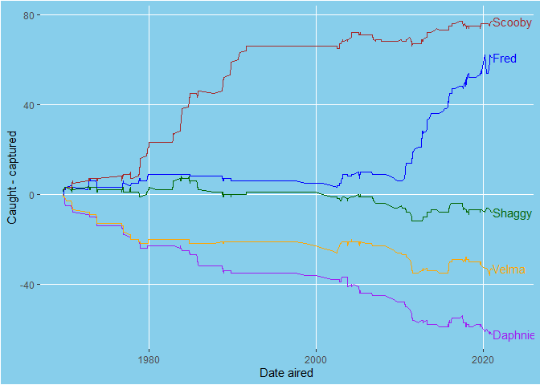

TidyTemplate
================
2021-07-14

# TidyTuesday

Join the R4DS Online Learning Community in the weekly \#TidyTuesday
event! Every week we post a raw dataset, a chart or article related to
that dataset, and ask you to explore the data. While the dataset will be
“tamed”, it will not always be tidy! As such you might need to apply
various R for Data Science techniques to wrangle the data into a true
tidy format. The goal of TidyTuesday is to apply your R skills, get
feedback, explore other’s work, and connect with the greater \#RStats
community! As such we encourage everyone of all skills to participate!

# Load the weekly Data

Dowload the weekly data and make available in the `tt` object.

``` r
tt <- tt_load("2021-07-13")
```

    ## --- Compiling #TidyTuesday Information for 2021-07-13 ----

    ## --- There is 1 file available ---

    ## --- Starting Download ---

    ## 
    ##  Downloading file 1 of 1: `scoobydoo.csv`

    ## --- Download complete ---

# Readme

Take a look at the readme for the weekly data to get insight on the
dataset. This includes a data dictionary, source, and a link to an
article on the data.

``` r
tt
```

# Glimpse Data

Take an initial look at the format of the data available.

``` r
tt %>% 
  map(glimpse)
```

    ## Rows: 603
    ## Columns: 75
    ## $ index                    <dbl> 1, 2, 3, 4, 5, 6, 7, 8, 9, 10, 11, 12, 13, 14~
    ## $ series_name              <chr> "Scooby Doo, Where Are You!", "Scooby Doo, Wh~
    ## $ network                  <chr> "CBS", "CBS", "CBS", "CBS", "CBS", "CBS", "CB~
    ## $ season                   <chr> "1", "1", "1", "1", "1", "1", "1", "1", "1", ~
    ## $ title                    <chr> "What a Night for a Knight", "A Clue for Scoo~
    ## $ imdb                     <chr> "8.1", "8.1", "8", "7.8", "7.5", "8.4", "7.6"~
    ## $ engagement               <chr> "556", "479", "455", "426", "391", "384", "35~
    ## $ date_aired               <date> 1969-09-13, 1969-09-20, 1969-09-27, 1969-10-~
    ## $ run_time                 <dbl> 21, 22, 21, 21, 21, 21, 21, 21, 21, 21, 21, 2~
    ## $ format                   <chr> "TV Series", "TV Series", "TV Series", "TV Se~
    ## $ monster_name             <chr> "Black Knight", "Ghost of Cptn. Cuttler", "Ph~
    ## $ monster_gender           <chr> "Male", "Male", "Male", "Male", "Female", "Ma~
    ## $ monster_type             <chr> "Possessed Object", "Ghost", "Ghost", "Ancien~
    ## $ monster_subtype          <chr> "Suit", "Suit", "Phantom", "Miner", "Witch Do~
    ## $ monster_species          <chr> "Object", "Human", "Human", "Human", "Human",~
    ## $ monster_real             <chr> "FALSE", "FALSE", "FALSE", "FALSE", "FALSE", ~
    ## $ monster_amount           <dbl> 1, 1, 1, 1, 1, 1, 1, 1, 1, 1, 3, 1, 2, 1, 1, ~
    ## $ caught_fred              <chr> "FALSE", "FALSE", "FALSE", "TRUE", "FALSE", "~
    ## $ caught_daphnie           <chr> "FALSE", "FALSE", "FALSE", "FALSE", "FALSE", ~
    ## $ caught_velma             <chr> "FALSE", "FALSE", "FALSE", "FALSE", "FALSE", ~
    ## $ caught_shaggy            <chr> "TRUE", "TRUE", "FALSE", "FALSE", "FALSE", "F~
    ## $ caught_scooby            <chr> "TRUE", "FALSE", "TRUE", "FALSE", "TRUE", "FA~
    ## $ captured_fred            <chr> "FALSE", "TRUE", "FALSE", "FALSE", "FALSE", "~
    ## $ captured_daphnie         <chr> "FALSE", "TRUE", "FALSE", "FALSE", "FALSE", "~
    ## $ captured_velma           <chr> "FALSE", "TRUE", "FALSE", "FALSE", "FALSE", "~
    ## $ captured_shaggy          <chr> "FALSE", "FALSE", "FALSE", "FALSE", "FALSE", ~
    ## $ captured_scooby          <chr> "FALSE", "FALSE", "FALSE", "FALSE", "TRUE", "~
    ## $ unmask_fred              <chr> "FALSE", "TRUE", "TRUE", "TRUE", "FALSE", "TR~
    ## $ unmask_daphnie           <chr> "FALSE", "FALSE", "FALSE", "FALSE", "FALSE", ~
    ## $ unmask_velma             <chr> "FALSE", "FALSE", "FALSE", "FALSE", "FALSE", ~
    ## $ unmask_shaggy            <chr> "FALSE", "FALSE", "FALSE", "FALSE", "FALSE", ~
    ## $ unmask_scooby            <chr> "TRUE", "FALSE", "FALSE", "FALSE", "TRUE", "F~
    ## $ snack_fred               <chr> "TRUE", "FALSE", "TRUE", "FALSE", "FALSE", "T~
    ## $ snack_daphnie            <chr> "FALSE", "FALSE", "FALSE", "TRUE", "TRUE", "F~
    ## $ snack_velma              <chr> "FALSE", "TRUE", "FALSE", "FALSE", "FALSE", "~
    ## $ snack_shaggy             <chr> "FALSE", "FALSE", "FALSE", "FALSE", "FALSE", ~
    ## $ snack_scooby             <chr> "FALSE", "FALSE", "FALSE", "FALSE", "FALSE", ~
    ## $ unmask_other             <lgl> FALSE, FALSE, FALSE, FALSE, FALSE, FALSE, FAL~
    ## $ caught_other             <lgl> FALSE, FALSE, FALSE, FALSE, FALSE, FALSE, FAL~
    ## $ caught_not               <lgl> FALSE, FALSE, FALSE, FALSE, FALSE, FALSE, FAL~
    ## $ trap_work_first          <chr> "NULL", "FALSE", "FALSE", "TRUE", "NULL", "TR~
    ## $ setting_terrain          <chr> "Urban", "Coast", "Island", "Cave", "Desert",~
    ## $ setting_country_state    <chr> "United States", "United States", "United Sta~
    ## $ suspects_amount          <dbl> 2, 2, 0, 2, 1, 2, 1, 2, 1, 1, 1, 1, 2, 2, 1, ~
    ## $ non_suspect              <chr> "FALSE", "TRUE", "TRUE", "FALSE", "FALSE", "F~
    ## $ arrested                 <chr> "TRUE", "TRUE", "TRUE", "TRUE", "TRUE", "TRUE~
    ## $ culprit_name             <chr> "Mr. Wickles", "Cptn. Cuttler", "Bluestone th~
    ## $ culprit_gender           <chr> "Male", "Male", "Male", "Male", "Male", "Male~
    ## $ culprit_amount           <dbl> 1, 1, 1, 1, 1, 1, 1, 1, 1, 1, 1, 1, 2, 1, 1, ~
    ## $ motive                   <chr> "Theft", "Theft", "Treasure", "Natural Resour~
    ## $ if_it_wasnt_for          <chr> "NULL", "NULL", "NULL", "NULL", "NULL", "NULL~
    ## $ and_that                 <chr> "NULL", "NULL", "NULL", "NULL", "NULL", "NULL~
    ## $ door_gag                 <lgl> FALSE, FALSE, FALSE, FALSE, FALSE, FALSE, FAL~
    ## $ number_of_snacks         <chr> "2", "1", "3", "2", "2", "4", "4", "0", "1", ~
    ## $ split_up                 <chr> "1", "0", "0", "1", "0", "0", "1", "0", "0", ~
    ## $ another_mystery          <chr> "1", "0", "0", "0", "1", "0", "0", "0", "0", ~
    ## $ set_a_trap               <chr> "0", "0", "0", "0", "0", "0", "1", "1", "0", ~
    ## $ jeepers                  <chr> "0", "0", "0", "0", "0", "1", "0", "0", "0", ~
    ## $ jinkies                  <chr> "0", "0", "0", "0", "0", "0", "0", "0", "0", ~
    ## $ my_glasses               <chr> "1", "0", "0", "0", "1", "0", "0", "1", "0", ~
    ## $ just_about_wrapped_up    <chr> "0", "0", "0", "0", "0", "0", "0", "0", "0", ~
    ## $ zoinks                   <chr> "1", "3", "1", "2", "0", "2", "1", "0", "0", ~
    ## $ groovy                   <chr> "0", "0", "2", "1", "0", "0", "1", "0", "0", ~
    ## $ scooby_doo_where_are_you <chr> "0", "1", "0", "0", "1", "0", "0", "1", "0", ~
    ## $ rooby_rooby_roo          <chr> "1", "0", "0", "0", "0", "1", "1", "1", "1", ~
    ## $ batman                   <lgl> FALSE, FALSE, FALSE, FALSE, FALSE, FALSE, FAL~
    ## $ scooby_dum               <lgl> FALSE, FALSE, FALSE, FALSE, FALSE, FALSE, FAL~
    ## $ scrappy_doo              <lgl> FALSE, FALSE, FALSE, FALSE, FALSE, FALSE, FAL~
    ## $ hex_girls                <lgl> FALSE, FALSE, FALSE, FALSE, FALSE, FALSE, FAL~
    ## $ blue_falcon              <lgl> FALSE, FALSE, FALSE, FALSE, FALSE, FALSE, FAL~
    ## $ fred_va                  <chr> "Frank Welker", "Frank Welker", "Frank Welker~
    ## $ daphnie_va               <chr> "Stefanianna Christopherson", "Stefanianna Ch~
    ## $ velma_va                 <chr> "Nicole Jaffe", "Nicole Jaffe", "Nicole Jaffe~
    ## $ shaggy_va                <chr> "Casey Kasem", "Casey Kasem", "Casey Kasem", ~
    ## $ scooby_va                <chr> "Don Messick", "Don Messick", "Don Messick", ~

    ## $scoobydoo
    ## # A tibble: 603 x 75
    ##    index series_name  network season title  imdb  engagement date_aired run_time
    ##    <dbl> <chr>        <chr>   <chr>  <chr>  <chr> <chr>      <date>        <dbl>
    ##  1     1 Scooby Doo,~ CBS     1      What ~ 8.1   556        1969-09-13       21
    ##  2     2 Scooby Doo,~ CBS     1      A Clu~ 8.1   479        1969-09-20       22
    ##  3     3 Scooby Doo,~ CBS     1      Hassl~ 8     455        1969-09-27       21
    ##  4     4 Scooby Doo,~ CBS     1      Mine ~ 7.8   426        1969-10-04       21
    ##  5     5 Scooby Doo,~ CBS     1      Decoy~ 7.5   391        1969-10-11       21
    ##  6     6 Scooby Doo,~ CBS     1      What ~ 8.4   384        1969-10-18       21
    ##  7     7 Scooby Doo,~ CBS     1      Never~ 7.6   358        1969-10-25       21
    ##  8     8 Scooby Doo,~ CBS     1      Foul ~ 8.2   358        1969-11-01       21
    ##  9     9 Scooby Doo,~ CBS     1      The B~ 8.1   371        1969-11-08       21
    ## 10    10 Scooby Doo,~ CBS     1      Bedla~ 8     346        1969-11-15       21
    ## # ... with 593 more rows, and 66 more variables: format <chr>,
    ## #   monster_name <chr>, monster_gender <chr>, monster_type <chr>,
    ## #   monster_subtype <chr>, monster_species <chr>, monster_real <chr>,
    ## #   monster_amount <dbl>, caught_fred <chr>, caught_daphnie <chr>,
    ## #   caught_velma <chr>, caught_shaggy <chr>, caught_scooby <chr>,
    ## #   captured_fred <chr>, captured_daphnie <chr>, captured_velma <chr>,
    ## #   captured_shaggy <chr>, captured_scooby <chr>, unmask_fred <chr>,
    ## #   unmask_daphnie <chr>, unmask_velma <chr>, unmask_shaggy <chr>,
    ## #   unmask_scooby <chr>, snack_fred <chr>, snack_daphnie <chr>,
    ## #   snack_velma <chr>, snack_shaggy <chr>, snack_scooby <chr>,
    ## #   unmask_other <lgl>, caught_other <lgl>, caught_not <lgl>,
    ## #   trap_work_first <chr>, setting_terrain <chr>, setting_country_state <chr>,
    ## #   suspects_amount <dbl>, non_suspect <chr>, arrested <chr>,
    ## #   culprit_name <chr>, culprit_gender <chr>, culprit_amount <dbl>,
    ## #   motive <chr>, if_it_wasnt_for <chr>, and_that <chr>, door_gag <lgl>,
    ## #   number_of_snacks <chr>, split_up <chr>, another_mystery <chr>,
    ## #   set_a_trap <chr>, jeepers <chr>, jinkies <chr>, my_glasses <chr>,
    ## #   just_about_wrapped_up <chr>, zoinks <chr>, groovy <chr>,
    ## #   scooby_doo_where_are_you <chr>, rooby_rooby_roo <chr>, batman <lgl>,
    ## #   scooby_dum <lgl>, scrappy_doo <lgl>, hex_girls <lgl>, blue_falcon <lgl>,
    ## #   fred_va <chr>, daphnie_va <chr>, velma_va <chr>, shaggy_va <chr>,
    ## #   scooby_va <chr>

# Wrangle

Explore the data and process it into a nice format for plotting! Access
each dataset by name by using a dollarsign after the `tt` object and
then the name of the data set.

``` r
dat <- tt$scoobydoo %>% 
  mutate(across(starts_with("caught"), ~ .x == TRUE),
         across(starts_with("captured"), ~ .x == TRUE),
         across(starts_with("caught"), ~ cumsum(.x), .names = "{.col}_sum"),
         across(starts_with("captured"), ~ cumsum(.x), .names = "{.col}_sum")
         ) %>% 
  select(matches("caught|captured"), "date_aired") %>% 
  pivot_longer(cols = matches("caught|captured"), names_sep = "_", names_to = c("cap", "who", "sum")) %>% 
  pivot_wider(names_from = "cap", values_from = "value", values_fn = function(x) `[[`(x, 1)) %>% 
  filter(!who %in% c("other", "not")) %>% 
  filter(!is.na(sum)) %>% 
  mutate(overall = caught - captured)
```

    ## Warning: Expected 3 pieces. Missing pieces filled with `NA` in 12 rows [1, 2, 3,
    ## 4, 5, 6, 7, 8, 9, 10, 11, 12].

# Visualize

Using your processed dataset, create your unique visualization.

``` r
dat  %>% 
  ggplot(aes(y = overall, x = date_aired, col = factor(who))) +
  geom_line() +
  scale_color_manual(values = c("purple", "blue", "brown", "darkgreen", "orange")) +
  ylab("Caught - captured") +
  xlab("Date aired") +
  geom_text(data = dat %>% group_by(who) %>% slice_tail(n = 1),
            aes(x = date_aired+100, y = overall, label = str_to_sentence(who)), 
            hjust = "left"
            # nudge_x = 700
            ) +
  guides(col = guide_none()) +
  xlim(min(dat$date_aired), max(dat$date_aired)+800) +
  theme(plot.background = element_rect(fill = "skyblue"), 
        panel.background = element_rect(fill = "skyblue"),
        panel.grid.minor = element_blank())
```

<!-- -->

# Save Image

Save your image for sharing. Be sure to use the `#TidyTuesday` hashtag
in your post on twitter!

``` r
# This will save your most recent plot
ggsave(
  filename = "My TidyTuesday Plot.png",
  device = "png")
```

    ## Saving 7 x 5 in image
