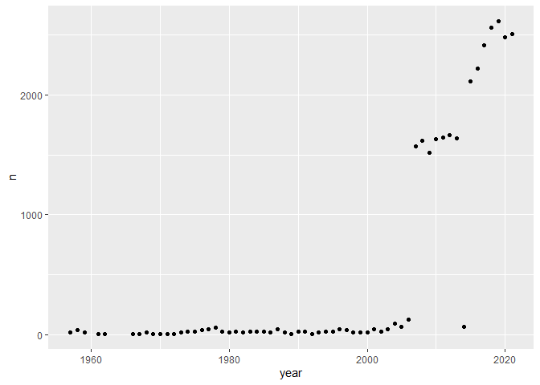
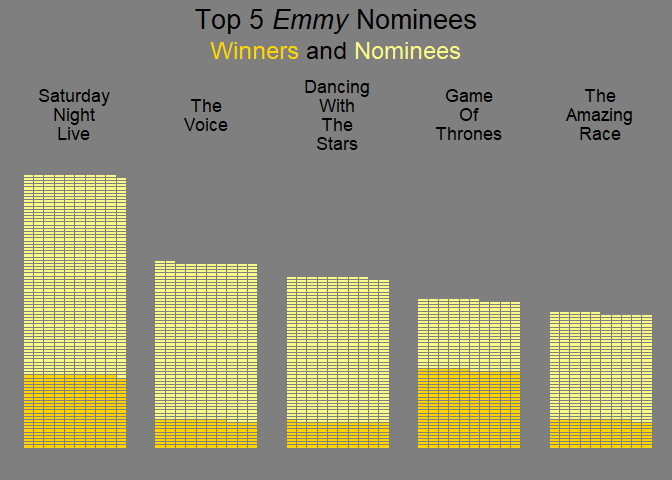

TidyTemplate
================
2021-09-21

# TidyTuesday

Join the R4DS Online Learning Community in the weekly \#TidyTuesday
event! Every week we post a raw dataset, a chart or article related to
that dataset, and ask you to explore the data. While the dataset will be
“tamed”, it will not always be tidy! As such you might need to apply
various R for Data Science techniques to wrangle the data into a true
tidy format. The goal of TidyTuesday is to apply your R skills, get
feedback, explore other’s work, and connect with the greater \#RStats
community! As such we encourage everyone of all skills to participate!

# Load the weekly Data

Dowload the weekly data and make available in the `tt` object.

``` r
tt <- tt_load("2021-09-21")
```

    ## --- Compiling #TidyTuesday Information for 2021-09-21 ----

    ## --- There is 1 file available ---

    ## --- Starting Download ---

    ## 
    ##  Downloading file 1 of 1: `nominees.csv`

    ## --- Download complete ---

# Readme

Take a look at the readme for the weekly data to get insight on the
dataset. This includes a data dictionary, source, and a link to an
article on the data.

``` r
tt
```

# Glimpse Data

Take an initial look at the format of the data available.

``` r
tt %>% 
  map(glimpse)
```

    ## Rows: 29,678
    ## Columns: 10
    ## $ category    <chr> "Outstanding Character Voice-Over Performance - 2021", "Ou~
    ## $ logo        <chr> "https://www.emmys.com/sites/default/files/styles/show_sea~
    ## $ production  <chr> NA, NA, NA, NA, "Elisabeth Williams, Production Designer",~
    ## $ type        <chr> "Nominee", "Nominee", "Nominee", "Nominee", "Nominee", "No~
    ## $ title       <chr> "black-ish: Election Special (Part 2)", "Bridgerton", "Fam~
    ## $ distributor <chr> "ABC", "Netflix", "FOX", "FX Networks", "Hulu", "Hulu", "H~
    ## $ producer    <chr> "ABC", "A Netflix Original Series in association with shon~
    ## $ year        <dbl> 2021, 2021, 2021, 2021, 2021, 2021, 2021, 2021, 2021, 2021~
    ## $ page        <dbl> 0, 0, 0, 0, 0, 0, 0, 0, 0, 0, 0, 0, 0, 0, 0, 0, 0, 0, 0, 0~
    ## $ page_id     <dbl> 1, 2, 3, 4, 5, 5, 5, 5, 6, 6, 6, 7, 7, 7, 8, 8, 8, 9, 9, 9~

    ## $nominees
    ## # A tibble: 29,678 x 10
    ##    category   logo    production  type   title distributor producer   year  page
    ##    <chr>      <chr>   <chr>       <chr>  <chr> <chr>       <chr>     <dbl> <dbl>
    ##  1 Outstandi~ https:~ <NA>        Nomin~ blac~ ABC         ABC        2021     0
    ##  2 Outstandi~ https:~ <NA>        Nomin~ Brid~ Netflix     A Netfli~  2021     0
    ##  3 Outstandi~ https:~ <NA>        Nomin~ Fami~ FOX         20th Tel~  2021     0
    ##  4 Outstandi~ https:~ <NA>        Nomin~ Arch~ FX Networks FX Produ~  2021     0
    ##  5 Outstandi~ https:~ Elisabeth ~ Nomin~ The ~ Hulu        Hulu, MG~  2021     0
    ##  6 Outstandi~ https:~ Martha Spa~ Nomin~ The ~ Hulu        Hulu, MG~  2021     0
    ##  7 Outstandi~ https:~ Larry Spit~ Nomin~ The ~ Hulu        Hulu, MG~  2021     0
    ##  8 Outstandi~ https:~ Rob Hepbur~ Nomin~ The ~ Hulu        Hulu, MG~  2021     0
    ##  9 Outstandi~ https:~ Lester Coh~ Nomin~ The ~ HBO         HBO in a~  2021     0
    ## 10 Outstandi~ https:~ Doug Huszt~ Nomin~ The ~ HBO         HBO in a~  2021     0
    ## # ... with 29,668 more rows, and 1 more variable: page_id <dbl>

# Wrangle

Explore the data and process it into a nice format for plotting! Access
each dataset by name by using a dollarsign after the `tt` object and
then the name of the data set.

``` r
map(tt$nominees, ~ length(unique(.x)))
```

    ## $category
    ## [1] 1821
    ## 
    ## $logo
    ## [1] 1803
    ## 
    ## $production
    ## [1] 16461
    ## 
    ## $type
    ## [1] 2
    ## 
    ## $title
    ## [1] 2022
    ## 
    ## $distributor
    ## [1] 200
    ## 
    ## $producer
    ## [1] 1507
    ## 
    ## $year
    ## [1] 61
    ## 
    ## $page
    ## [1] 898
    ## 
    ## $page_id
    ## [1] 10

``` r
View(tt$nominees)

dat <- tt$nominees %>% 
  mutate(
    # remove year
    category = str_remove(category, " - \\d{4}"),
    # sentence case
    category = str_to_sentence(category)
  )

dat %>% 
  count(category)
```

    ## # A tibble: 413 x 2
    ##    category                                                                    n
    ##    <chr>                                                                   <int>
    ##  1 Actor-best single performance-lead or support                               5
    ##  2 Actress-best single performance-lead or support                             5
    ##  3 Best actor in a leading role (continuing character) in a dramatic seri~     3
    ##  4 Best actress in a leading role (continuing character) in a comedy seri~     6
    ##  5 Best actress in a leading role (continuing character) in a dramatic se~     1
    ##  6 Best continuing performance (female) in a series by a comedienne, sing~     5
    ##  7 Best continuing performance (male) in a series by a comedian, singer, ~     5
    ##  8 Best continuing performance by a comedian in a series                       5
    ##  9 Best continuing performance by a comedienne in a series                     5
    ## 10 Best continuing performance by an actor                                     5
    ## # ... with 403 more rows

# Visualize

Using your processed dataset, create your unique visualization.

``` r
dat %>% 
  group_by(year) %>% 
  summarize(n = n()) %>% 
  ggplot(aes(x = year, y = n)) +
  geom_point()
```

<!-- -->

``` r
cols <- c("#ffd500", "#fafa89", "grey50")

grid <- expand.grid(x = 1:10, y = 1:86)
tmp <- dat %>% 
  group_by(title, type) %>% 
  summarize(n = n()) %>% 
  group_by(title) %>% 
  mutate(N = sum(n)) %>% 
  arrange(desc(N)) %>% 
  ungroup() %>% 
  slice_head(n = 10) 
```

    ## `summarise()` has grouped output by 'title'. You can override using the `.groups` argument.

``` r
map(unique(tmp$title), function(.x){
  grid$col <- c(rep(cols[1], tmp$n[tmp$title == .x & tmp$type == "Winner"]),
                rep(cols[2], tmp$n[tmp$title == .x & tmp$type == "Nominee"]),
                rep(cols[3], 860 - sum(tmp$n[tmp$title == .x])))
  ggplot(grid, aes(x = x, y = y, fill = I(col))) +
    geom_tile(col = cols[3]) +
    labs(title = str_replace_all(.x, " ", "\n")) +
    theme(panel.background = element_rect(fill = cols[3], colour = NULL),
          plot.background = element_rect(linetype = NULL, fill = cols[3], colour = NULL),
          panel.grid = element_blank(),
          axis.title = element_blank(),
          axis.text = element_blank(),
          axis.ticks = element_blank(),
          plot.title = element_text(hjust = 0.5)
          )
  
}) %>% 
  wrap_plots() + 
  plot_layout(5, 1) + 
  plot_annotation("Top 5 *Emmy* Nominees", 
                  theme = theme(plot.title = element_markdown(hjust = 0.5, 
                                                          size = 20))) +
  plot_annotation(subtitle = "<span style='color:#ffd500;'>Winners</span> and <span style='color:#fafa89;'>Nominees</span>", 
                  theme = theme(plot.subtitle = element_markdown(hjust = 0.5, 
                                                          size = 18),
                                plot.background = element_rect(fill = cols[3], colour = cols[3]),
                                )) &
  theme(plot.background = element_rect(fill = cols[3], colour = cols[3]))
```

<!-- -->

# Save Image

Save your image for sharing. Be sure to use the `#TidyTuesday` hashtag
in your post on twitter!

``` r
# This will save your most recent plot
ggsave(
  filename = "My TidyTuesday Plot.png",
  device = "png")
```

    ## Saving 7 x 5 in image
