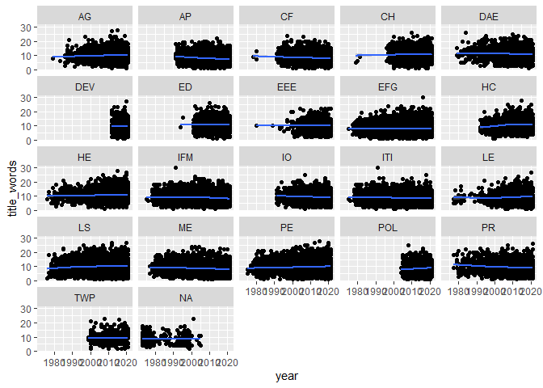
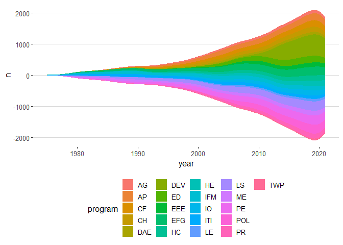
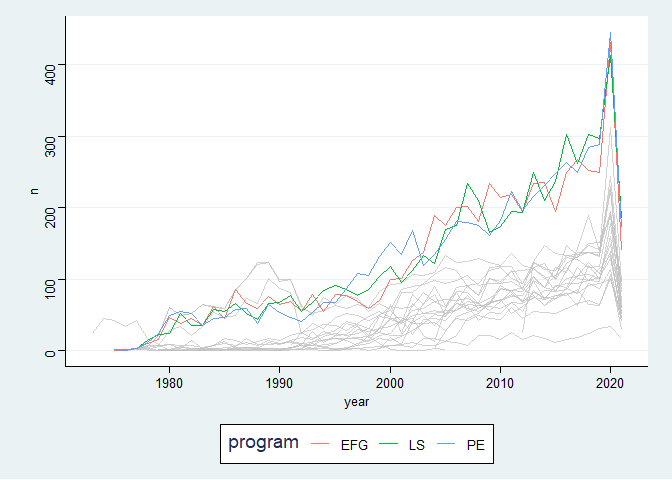
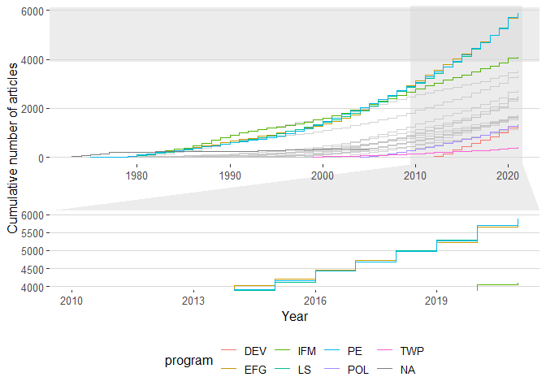

TidyTemplate
================
2021-09-29

# TidyTuesday

Join the R4DS Online Learning Community in the weekly \#TidyTuesday
event! Every week we post a raw dataset, a chart or article related to
that dataset, and ask you to explore the data. While the dataset will be
“tamed”, it will not always be tidy! As such you might need to apply
various R for Data Science techniques to wrangle the data into a true
tidy format. The goal of TidyTuesday is to apply your R skills, get
feedback, explore other’s work, and connect with the greater \#RStats
community! As such we encourage everyone of all skills to participate!

# Load the weekly Data

Dowload the weekly data and make available in the `tt` object.

``` r
papers <- readr::read_csv('https://raw.githubusercontent.com/rfordatascience/tidytuesday/master/data/2021/2021-09-28/papers.csv')
```

    ## 
    ## -- Column specification --------------------------------------------------------
    ## cols(
    ##   paper = col_character(),
    ##   year = col_double(),
    ##   month = col_double(),
    ##   title = col_character()
    ## )

``` r
authors <- readr::read_csv('https://raw.githubusercontent.com/rfordatascience/tidytuesday/master/data/2021/2021-09-28/authors.csv')
```

    ## 
    ## -- Column specification --------------------------------------------------------
    ## cols(
    ##   author = col_character(),
    ##   name = col_character(),
    ##   user_nber = col_character(),
    ##   user_repec = col_character()
    ## )

``` r
programs <- readr::read_csv('https://raw.githubusercontent.com/rfordatascience/tidytuesday/master/data/2021/2021-09-28/programs.csv')
```

    ## 
    ## -- Column specification --------------------------------------------------------
    ## cols(
    ##   program = col_character(),
    ##   program_desc = col_character(),
    ##   program_category = col_character()
    ## )

``` r
paper_authors <- readr::read_csv('https://raw.githubusercontent.com/rfordatascience/tidytuesday/master/data/2021/2021-09-28/paper_authors.csv')
```

    ## 
    ## -- Column specification --------------------------------------------------------
    ## cols(
    ##   paper = col_character(),
    ##   author = col_character()
    ## )

``` r
paper_programs <- readr::read_csv('https://raw.githubusercontent.com/rfordatascience/tidytuesday/master/data/2021/2021-09-28/paper_programs.csv')
```

    ## 
    ## -- Column specification --------------------------------------------------------
    ## cols(
    ##   paper = col_character(),
    ##   program = col_character()
    ## )

# Wrangle

Explore the data and process it into a nice format for plotting! Access
each dataset by name by using a dollarsign after the `tt` object and
then the name of the data set.

``` r
papers_mod <- papers %>% 
  mutate(title_words = stringr::str_count(title, "\\S+"))
```

# Visualize

Using your processed dataset, create your unique visualization.

``` r
papers_mod %>% 
  left_join(paper_programs) %>% 
  ggplot(aes(x = year, y = title_words)) +
  geom_point() +
  stat_smooth() + 
  facet_wrap("program")
```

    ## Joining, by = "paper"

    ## `geom_smooth()` using method = 'gam' and formula 'y ~ s(x, bs = "cs")'

<!-- -->

No real change in length of title…

``` r
# remotes::install_github("davidsjoberg/ggstream")
library(ggstream)
# install.packages("ggthemes")
library(ggthemes)
# install.packages("gghighlight")
library(gghighlight)
library(ggforce)


papers_mod %>% 
  left_join(paper_programs) %>% 
  count(year, program) %>% 
  ggplot(aes(x = year, y = n, fill = program)) +
  geom_stream() +
  theme_hc()
```

    ## Joining, by = "paper"

<!-- -->

``` r
papers_mod %>% 
  left_join(paper_programs) %>% 
  count(year, program) %>% 
  ggplot(aes(x = year, y = n, col = program)) +
  geom_line() +
  # gghighlight(program == "DEV")
  gghighlight(max(n) > 400, use_direct_label = FALSE) +
  theme_stata()
```

    ## Joining, by = "paper"

<!-- -->

``` r
papers_mod %>% 
  left_join(paper_programs) %>% 
  count(year, program) %>% 
  group_by(program) %>% 
  mutate(cum = cumsum(n)) %>% 
  ggplot(aes(x = year, y = cum, col = program)) +
  geom_step() +
  theme_hc() +
  gghighlight(min(year) > 2000 | max(cum) < 1000 | max(cum) > 4000, use_direct_label = FALSE) +
  labs(y = "Cumulative number of articles",
       x = "Year") +
  facet_zoom(xlim = c(2010, 2021), ylim = c(4000, 6000), horizontal = FALSE, zoom.size = .5)
```

    ## Joining, by = "paper"

<!-- -->

# Save Image

Save your image for sharing. Be sure to use the `#TidyTuesday` hashtag
in your post on twitter!

``` r
# This will save your most recent plot
ggsave(
  filename = "My TidyTuesday Plot.png",
  device = "png")
```

    ## Saving 7 x 5 in image
