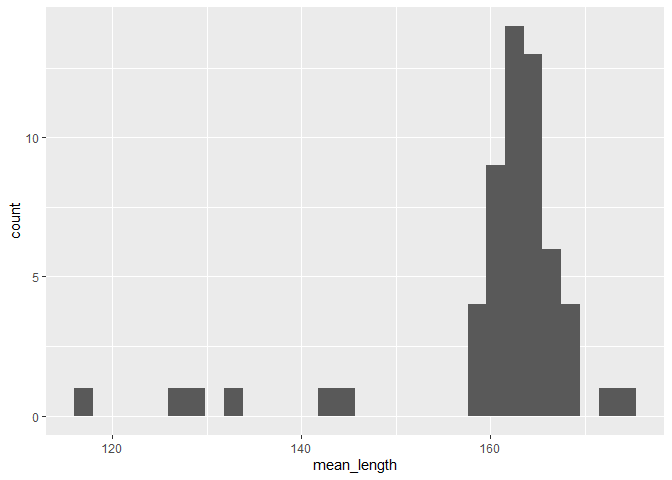
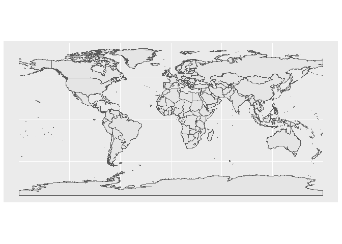
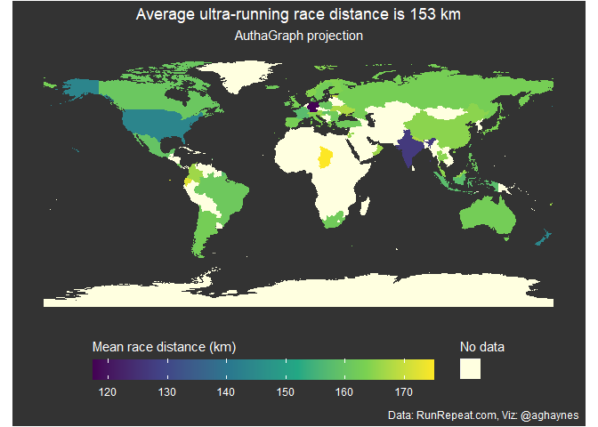
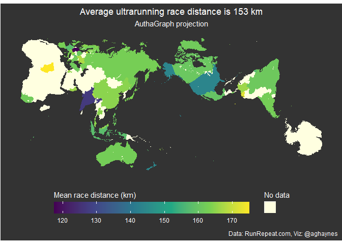

README
================

## TidyTuesday 2021-10-26 - Ultra runners

``` r
ultra_rankings <- readr::read_csv('https://raw.githubusercontent.com/rfordatascience/tidytuesday/master/data/2021/2021-10-26/ultra_rankings.csv')
```

    ## 
    ## -- Column specification --------------------------------------------------------
    ## cols(
    ##   race_year_id = col_double(),
    ##   rank = col_double(),
    ##   runner = col_character(),
    ##   time = col_character(),
    ##   age = col_double(),
    ##   gender = col_character(),
    ##   nationality = col_character(),
    ##   time_in_seconds = col_double()
    ## )

``` r
race <- readr::read_csv('https://raw.githubusercontent.com/rfordatascience/tidytuesday/master/data/2021/2021-10-26/race.csv')
```

    ## 
    ## -- Column specification --------------------------------------------------------
    ## cols(
    ##   race_year_id = col_double(),
    ##   event = col_character(),
    ##   race = col_character(),
    ##   city = col_character(),
    ##   country = col_character(),
    ##   date = col_date(format = ""),
    ##   start_time = col_time(format = ""),
    ##   participation = col_character(),
    ##   distance = col_double(),
    ##   elevation_gain = col_double(),
    ##   elevation_loss = col_double(),
    ##   aid_stations = col_double(),
    ##   participants = col_double()
    ## )

``` r
cou <- race %>% 
  group_by(country) %>% 
  summarize(n = n(),
            mean_length = mean(distance),
            max_length = max(distance),
            mean_elev_gain = mean(elevation_gain),
            max_elev_gain = max(elevation_gain)) %>% 
  filter(mean_length > 0)
```

``` r
cou %>% 
  ggplot(aes(x = mean_length)) +
  geom_histogram()
```

    ## `stat_bin()` using `bins = 30`. Pick better value with `binwidth`.

<!-- -->

``` r
race %>% View
```

#### Spatial

``` r
library("rnaturalearth")
library("rnaturalearthdata")
library(sf)
```

    ## Linking to GEOS 3.9.0, GDAL 3.2.1, PROJ 7.2.1

``` r
world <- ne_countries(scale = "medium", returnclass = "sf")
world %>% 
  ggplot() +
  geom_sf()
```

<!-- -->

``` r
couworld <- world %>% 
  full_join(cou %>% 
              rename(name = country)) 
```

    ## Joining, by = "name"

``` r
p <- couworld %>% 
  ggplot() +
  geom_sf(aes(fill = mean_length, col = "")) +
  # scale_fill_continuous(na.value = "white") +
  theme(axis.text = element_blank(), 
        axis.ticks = element_blank(), 
        plot.background = element_rect(fill = "grey20"),
        panel.background = element_rect(fill = "grey20"),
        plot.title = element_text(hjust = 0.5, colour = "white"),
        plot.subtitle = element_text(hjust = 0.5, colour = "white"),
        plot.caption = element_text(colour = "white"),
        legend.position="bottom",
        panel.grid = element_blank(), 
        legend.background = element_rect(fill = "grey20"),
        legend.title = element_text(colour = "white"),
        legend.text = element_text(colour = "white"), 
        ) +
  ggtitle(
    label = glue::glue("Average ultra-running race distance is {round(mean(race$distance))} km"),
    subtitle = "AuthaGraph projection") +
  labs(caption = "Data: RunRepeat.com, Viz: @aghaynes") +
  scale_fill_viridis_c(guide = "colourbar", 
                       na.value = "lightyellow") +
  scale_colour_manual(values = NA) +              
  guides(fill = guide_colourbar(title.position = "top", 
                                barwidth = 20,
                                title = "Mean race distance (km)", 
                                order = 1),
         colour = guide_legend(title.position = "top", 
                                title = "No data",
                          override.aes=list(fill="lightyellow", colour = "lightyellow")))

p
```

<!-- -->

``` r
library(rayshader)


for(y in c(3210000)){
  pp <- p +
    coord_sf(crs = glue::glue("+proj=laea +lat_0=52 +lon_0=10 +x_0=4321000 +y_0={y} +ellps=GRS80 +units=m +no_defs "))
  
  # plot_gg(pp, multicore = TRUE, width = 6, height=2.7, fov = 70, zoom = .4, theta = 10)
  # render_snapshot(here::here("rayshader", glue::glue("y{y}")))

}
  # all equivalent
  # coord_sf(crs = "+proj=laea +lat_0=52 +lon_0=10 +x_0=4321000 +y_0=3210000 +ellps=GRS80 +units=m +no_defs ")
  # coord_sf(crs = "+init=epsg:3035")
  # coord_sf(crs = st_crs(3035))
  # ggspatial::annotation_north_arrow(location = "bl") +
  # ggspatial::annotation_scale(location = "bl", width_hint = 0.25)
```

## authagraph

``` r
auth <- imago::imago()
```

    ## Reading layer `imago-final' from data source `C:\Users\haynes\Documents\R\win-library\4.1\imago\geojson\imago-final.geojson' using driver `GeoJSON'
    ## Simple feature collection with 401 features and 1 field
    ## Geometry type: GEOMETRY
    ## Dimension:     XY
    ## Bounding box:  xmin: -121.9723 ymin: 37.37338 xmax: -121.969 ymax: 37.37454
    ## Geodetic CRS:  WGS 84

``` r
auth %>% 
  full_join(couworld %>% 
              rename(iso3c = iso_a3) %>% 
              st_set_geometry(NULL)) %>% 
  ggplot() +
  geom_sf(aes(fill = mean_length, col = "")) +
  theme(axis.text = element_blank(), 
        axis.ticks = element_blank(), 
        plot.background = element_rect(fill = "grey20"),
        panel.background = element_rect(fill = "grey20"),
        plot.title = element_text(hjust = 0.5, colour = "white"),
        plot.subtitle = element_text(hjust = 0.5, colour = "white"),
        plot.caption = element_text(colour = "white"),
        legend.position="bottom",
        panel.grid = element_blank(), 
        legend.background = element_rect(fill = "grey20"),
        legend.title = element_text(colour = "white"),
        legend.text = element_text(colour = "white"), 
        ) +
  ggtitle(
    label = glue::glue("Average ultrarunning race distance is {round(mean(race$distance))} km"),
    subtitle = "AuthaGraph projection") +
  labs(caption = "Data: RunRepeat.com, Viz: @aghaynes") +
  scale_fill_viridis_c(guide = "colourbar", 
                       na.value = "lightyellow") +
  scale_colour_manual(values = NA) +              
  guides(fill = guide_colourbar(title.position = "top", 
                                barwidth = 20,
                                title = "Mean race distance (km)", 
                                order = 1),
         colour = guide_legend(title.position = "top", 
                                title = "No data",
                          override.aes=list(fill="lightyellow", colour = "lightyellow")))
```

    ## Joining, by = "iso3c"

    ## Warning: Removed 2 rows containing missing values (geom_sf).

<!-- -->
