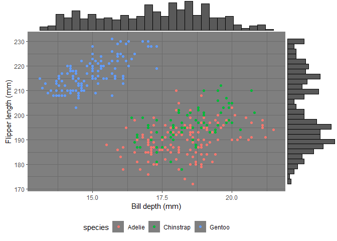
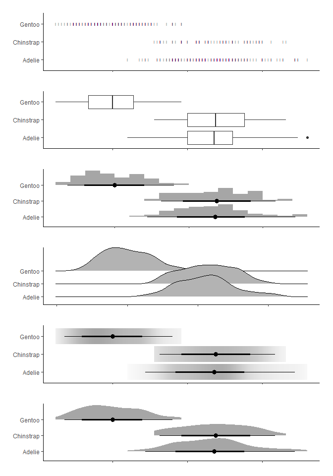

PalmerPenguins
================

``` r
library(palmerpenguins)
```

    ## Warning: package 'palmerpenguins' was built under R version 4.0.5

``` r
library(ggplot2)
```

    ## Warning: package 'ggplot2' was built under R version 4.0.5

``` r
library(ggExtra)
```

    ## Warning: package 'ggExtra' was built under R version 4.0.5

``` r
library(magrittr)
```

    ## Warning: package 'magrittr' was built under R version 4.0.4

``` r
library(ggridges)
```

    ## Warning: package 'ggridges' was built under R version 4.0.5

``` r
library(ggdist)
```

    ## Warning: package 'ggdist' was built under R version 4.0.5

    ## 
    ## Attaching package: 'ggdist'

    ## The following objects are masked from 'package:ggridges':
    ## 
    ##     scale_point_color_continuous, scale_point_color_discrete,
    ##     scale_point_colour_continuous, scale_point_colour_discrete,
    ##     scale_point_fill_continuous, scale_point_fill_discrete,
    ##     scale_point_size_continuous

``` r
library(patchwork)
```

    ## Warning: package 'patchwork' was built under R version 4.0.5

``` r
penguins %>%
  ggplot(aes(x = bill_depth_mm, y = flipper_length_mm, col = species)) +
  geom_point() +
  theme_dark() +
  theme(legend.position = "bottom") +
  xlab("Bill depth (mm)") +
  ylab("Flipper length (mm)") -> p
ggMarginal(p, type = "histogram")
```

    ## Warning: Removed 2 rows containing missing values (geom_point).

<!-- -->

``` r
theme <- theme_classic() %+replace%
  theme(plot.margin = unit(c(1,1,1,1), units = "line"), 
        axis.text.x = element_blank(),
        axis.title.x = element_blank(),
        axis.title.y = element_blank()
        )

pingu <- penguins
p <- pingu %>%
  dplyr::filter(!is.na(.data$bill_depth_mm)) %>%
  as.data.frame() 

p1 <- p %>%
  ggplot(aes(x = bill_depth_mm, y = factor(species))) +
  theme +
  geom_point(pch = "|")

p12 <- p %>%
  ggplot(aes(x = bill_depth_mm, y = factor(species))) +
  theme +
  geom_boxplot()

p2 <- p %>%
  ggplot(aes(x = bill_depth_mm, y = factor(species))) +
  theme +
  geom_density_ridges()

p3 <- p %>%
  ggplot(aes(x = bill_depth_mm, y = factor(species))) +
  theme +
  stat_histinterval()

p4 <- p %>%
  ggplot(aes(x = bill_depth_mm, y = factor(species))) +
  theme +
  stat_gradientinterval()

p5 <- p %>%
  ggplot(aes(x = bill_depth_mm, y = factor(species))) +
  theme +
  stat_halfeye()


p1/p12/p3/p2/p4/p5
```

    ## Picking joint bandwidth of 0.382

<!-- -->
