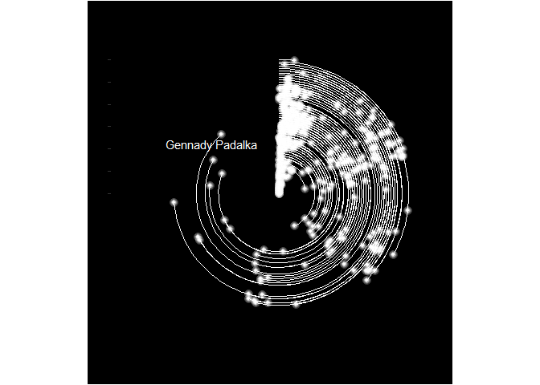
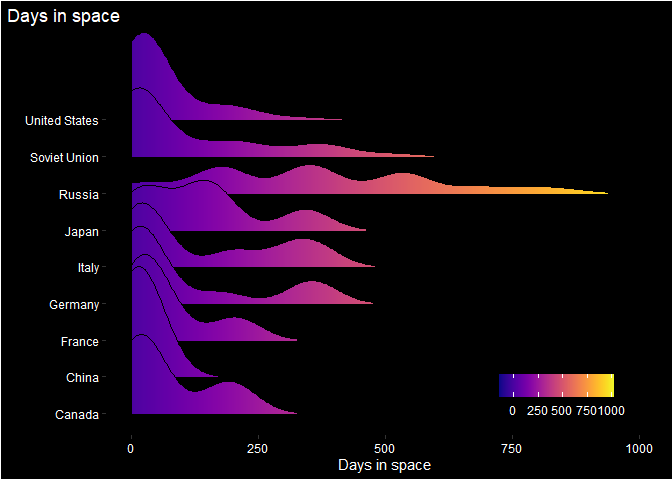

Astronauts
================

Data comes from <https://data.mendeley.com/datasets/86tsnnbv2w/1>

``` r
library(tidyverse)
```

    ## -- Attaching packages --------------------------------------- tidyverse 1.3.1 --

    ## v ggplot2 3.3.3     v purrr   0.3.4
    ## v tibble  3.1.0     v dplyr   1.0.5
    ## v tidyr   1.1.3     v stringr 1.4.0
    ## v readr   1.4.0     v forcats 0.5.1

    ## Warning: package 'ggplot2' was built under R version 4.0.5

    ## Warning: package 'tibble' was built under R version 4.0.5

    ## Warning: package 'tidyr' was built under R version 4.0.5

    ## Warning: package 'readr' was built under R version 4.0.5

    ## Warning: package 'dplyr' was built under R version 4.0.5

    ## Warning: package 'forcats' was built under R version 4.0.5

    ## -- Conflicts ------------------------------------------ tidyverse_conflicts() --
    ## x dplyr::filter() masks stats::filter()
    ## x dplyr::lag()    masks stats::lag()

``` r
# remotes::install_github("coolbutuseless/ggblur")
library(ggblur)
library(ggrepel)
```

    ## Warning: package 'ggrepel' was built under R version 4.0.5

``` r
library(ggridges)
```

    ## Warning: package 'ggridges' was built under R version 4.0.5

``` r
library(viridis)
```

    ## Loading required package: viridisLite

    ## Warning: package 'viridisLite' was built under R version 4.0.5

``` r
names(dat)[5:6] <- c("n_flights", "flighttime")

dat2 <- dat %>%
  mutate(days = str_sub(flighttime, 1,3),
         days = as.numeric(days),
         first_flight = str_extract(Flights, "[:digit:]{4}"),
         first_flight = as.numeric(first_flight),
         first = min(first_flight),
         first_flight = first_flight - first) %>%
  arrange(days) 

longest <- dat2 %>%
  arrange(desc(days)) %>%
  slice(1)

dat2 %>%
  ggplot(aes(y = first_flight, x = days, group = Name)) +
  geom_linerange(aes(xmin = 0, xmax = days), col = "white") +
  geom_point_blur(col = "white", blur_size = .5, size = .5) +
  xlim(0, 1000) +
  # coord_flip()  + 
  geom_text_repel(data = longest,
                  mapping = aes(x = days, 
                                y = first_flight, 
                                label = Name), 
                  col = "white", ) +
  coord_polar() +
  theme_dark() +
  ggtitle("Time in Space") +
  theme(plot.background = element_rect(fill = "black"),
        panel.background = element_rect(fill = "black"),
        axis.text = element_blank(),
        axis.text.y = element_blank(),
        panel.grid.major = element_blank(),
        panel.grid.minor = element_blank())
```

<!-- -->

``` r
dat3 <- dat2 %>%
  group_by(Country) %>%
  mutate(astro_country = n(),
         mean = mean(days)) %>%
  filter(astro_country > 5) %>%
  arrange(mean) %>%
  mutate(cou = factor(Country, levels = unique(Country), labels = unique(Country)))


box <- dat3 %>%
  ggplot(aes(y = days, x = Country)) +
  geom_boxplot() + 
  coord_flip()


dat3 %>%
  ggplot(aes(x = days, y = cou, fill = ..x..)) +
  geom_density_ridges_gradient(scale = 3, rel_min_height = 0.01) +
  scale_fill_viridis(name = "", option = "C") +
  ggtitle("Days in space") +
  ylab("") +
  xlab("Days in space") +
  xlim(0, 1000) +
  theme(legend.position= c(.80, .1),
        legend.direction = "horizontal",
        plot.background = element_rect(fill = "black"),
        panel.background = element_rect(fill = "black"),
        legend.background = element_rect(fill = "black"),
        legend.text = element_text(colour = "white"),
        legend.title = element_text(colour = "white"),
        axis.title = element_text(colour = "white"),
        axis.text = element_text(colour = "white"),
        panel.grid = element_blank(),
        title = element_text(colour = "white"),
        plot.title.position = "plot")
```

    ## Picking joint bandwidth of 48.6

<!-- -->
