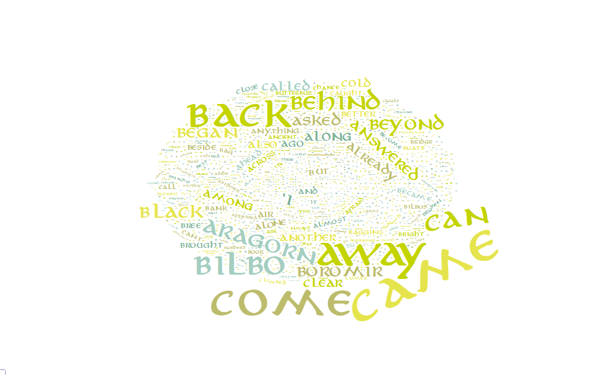

LOTR
================
11/05/2021

# Data

``` r
url <- "https://ae-lib.org.ua/texts-c/tolkien__the_lord_of_the_rings_1__en.htm"
l <- readLines(url)
l <- l[which(l == "<h2>Foreword</h2>") : length(l)]

gsub("<.>", "", l[48])
```

    ## [1] ""

``` r
l <- gsub("<.{1,5}>", "", l)

l <- paste(l, collapse = " ")
words <- unlist(strsplit(l, " "))

library(stopwords)
```

    ## Warning: package 'stopwords' was built under R version 4.0.5

``` r
library(tidyverse)
```

    ## -- Attaching packages --------------------------------------- tidyverse 1.3.1 --

    ## v ggplot2 3.3.3     v purrr   0.3.4
    ## v tibble  3.1.0     v dplyr   1.0.5
    ## v tidyr   1.1.3     v stringr 1.4.0
    ## v readr   1.4.0     v forcats 0.5.1

    ## Warning: package 'ggplot2' was built under R version 4.0.5

    ## Warning: package 'tibble' was built under R version 4.0.5

    ## Warning: package 'tidyr' was built under R version 4.0.5

    ## Warning: package 'readr' was built under R version 4.0.5

    ## Warning: package 'dplyr' was built under R version 4.0.5

    ## Warning: package 'forcats' was built under R version 4.0.5

    ## -- Conflicts ------------------------------------------ tidyverse_conflicts() --
    ## x dplyr::filter() masks stats::filter()
    ## x dplyr::lag()    masks stats::lag()

``` r
d <- data.frame(words = words) %>% 
  mutate(words = str_remove_all(words, "[:punct:]"),
         words = tolower(words)) %>%
  group_by(words) %>%
  count(sort = TRUE) %>%
  filter(!words %in% stopwords()) %>%
  filter(!str_detect(words, "^<"))
```

# wordcloud2

``` r
library(wordcloud2)
```

    ## Warning: package 'wordcloud2' was built under R version 4.0.5

``` r
wordcloud2(d)
```

<!-- -->

``` r
my_graph <- wordcloud2(d, fontFamily = "aniron")

# http://24.media.tumblr.com/e7f84b164ca555df27ece58c9eef533b/tumblr_n4zlev5OTf1tze8l2o4_500.png
# https://imagecolorpicker.com/en

pal <- c("#a4cec0", "#7cb298", "#bcbc6c", "#e5e44d", "#c4d400")

my_graph <- wordcloud2(d, 
                       fontFamily = "aniron", 
                       color = sample(pal, nrow(d), TRUE))
my_graph <- wordcloud2(d, 
                       fontFamily = "aniron", 
                       color = sample(pal, nrow(d), TRUE), 
                       figPath = "One_Ring_Blender_Render_mask.png")


# save it in html
library("htmlwidgets")
```

    ## Warning: package 'htmlwidgets' was built under R version 4.0.4

``` r
saveWidget(my_graph,"tmp.html",selfcontained = F)

# and in png or pdf
webshot::webshot("tmp.html","fig_1.png", delay =25, vwidth = 1000, vheight=600)
```

<!-- -->

<!--  -->

# ggplot2

``` r
library(ggwordcloud)

d %>% 
  slice_head(n = 200) %>%
ggplot(aes(label = words, size = n)) +
  geom_text_wordcloud()


d %>% 
  slice_head(n = 100) %>%
ggplot(aes(label = words, size = n)) +
  geom_text_wordcloud() + 
  theme_minimal() +
  theme(text=element_text(family="aniron"))
```

No good…
