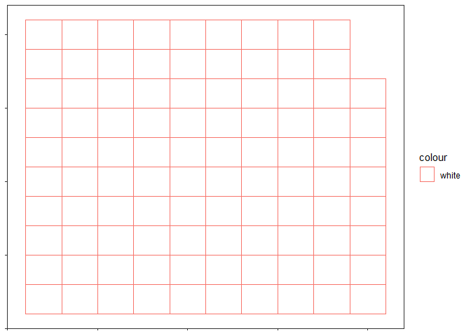

Day1\_part\_to\_whole
================
Alan Haynes

``` r
library(tidyverse)
```

    ## -- Attaching packages --------------------------------------- tidyverse 1.3.0 --

    ## v ggplot2 3.3.2     v purrr   0.3.4
    ## v tibble  3.1.0     v dplyr   1.0.2
    ## v tidyr   1.1.2     v stringr 1.4.0
    ## v readr   1.3.1     v forcats 0.5.0

    ## Warning: package 'tibble' was built under R version 4.0.4

    ## -- Conflicts ------------------------------------------ tidyverse_conflicts() --
    ## x dplyr::filter() masks stats::filter()
    ## x dplyr::lag()    masks stats::lag()

``` r
unique(types$type)
```

    ## [1] "Conventional thermal" "Nuclear"              "Hydro"               
    ## [4] "Pumped hydro power"   "Wind"                 "Solar"               
    ## [7] "Geothermal"           "Other"

``` r
unique(types$country_name)
```

    ##  [1] "Belgium"              "Bulgaria"             "Czechia"             
    ##  [4] "Denmark"              "Germany"              "Estonia"             
    ##  [7] "Ireland"              "Greece"               "Spain"               
    ## [10] "France"               "Croatia"              "Italy"               
    ## [13] "Cyprus"               "Latvia"               "Lithuania"           
    ## [16] "Luxembourg"           "Hungary"              "Malta"               
    ## [19] "Netherlands"          "Austria"              "Poland"              
    ## [22] "Portugal"             "Romania"              "Slovenia"            
    ## [25] "Slovakia"             "Finland"              "Sweden"              
    ## [28] NA                     "Norway"               "Montenegro"          
    ## [31] "North Macedonia"      "Albania"              "Serbia"              
    ## [34] "Turkey"               "Bosnia & Herzegovina" "Ukraine"             
    ## [37] "Georgia"

``` r
germany <- types %>% 
  filter(country == "DE") %>%
  rename(y2018 = "2018")


germany
```

    ## # A tibble: 8 x 7
    ##   country country_name type                 level   `2016` `2017`   y2018
    ##   <chr>   <chr>        <chr>                <chr>    <dbl>  <dbl>   <dbl>
    ## 1 DE      Germany      Conventional thermal Level 1 390141 376128 320438.
    ## 2 DE      Germany      Nuclear              Level 1  80038  72155  72274.
    ## 3 DE      Germany      Hydro                Level 1  25690  25888  20042.
    ## 4 DE      Germany      Pumped hydro power   Level 2   5451   5910   6661.
    ## 5 DE      Germany      Wind                 Level 1  78218 103707 112174 
    ## 6 DE      Germany      Solar                Level 1  38098  39401  46184 
    ## 7 DE      Germany      Geothermal           Level 1    165    157    165.
    ## 8 DE      Germany      Other                Level 1   1805   1623    523.

``` r
ggplot(germany, aes(y = y2018, fill = type, x = 1)) +
  geom_bar(position = "stack", stat = "identity") +
  scale_y_continuous(labels = scales::comma) +
  ylab("Gigawatt hours") +
  ggtitle("Energy sources in Germany, 2018") +
  labs(fill = "Energey source",
       caption = "Data: Eurostat") +
  theme_bw() +
  theme(axis.title.x = element_blank(),
        axis.text.x = element_blank(),
        axis.ticks.x = element_blank(),
        plot.title.position = "plot",
        legend.position = "top")
```

<!-- -->

``` r
# devtools::install_github("hrbrmstr/waffle")

g2 <- germany %>% 
  mutate(prop = y2018/sum(y2018)*100,
         prop = round(prop), 
         type = case_when(grepl("[hH]ydro", .data$type) ~ "Hydro",
                          TRUE ~ type))

library(waffle)

# extrafont::font_import()
# extrafont::loadfonts(device = "win")

ggplot(g2, aes(values = prop, fill = type, col = NA, label = type)) +
  # geom_waffle() +
  geom_pictogram(n_rows = 10,
                 flip = TRUE, make_proportional = TRUE) +
  theme_bw() +
  theme_enhance_waffle() +
  scale_label_pictogram(
    name = NULL,
    values = c("thermometer-full", "water", "atom", "solar-panel", "fan"),
    labels = c("Conventional thermal", "Hydro", "Nuclear", "Solar", "Wind")
  )
```

    ## Warning in grid.Call.graphics(C_text, as.graphicsAnnot(x$label), x$x, x$y, :
    ## font family not found in Windows font database

    ## Warning in grid.Call.graphics(C_text, as.graphicsAnnot(x$label), x$x, x$y, :
    ## font family not found in Windows font database

    ## Warning in grid.Call.graphics(C_text, as.graphicsAnnot(x$label), x$x, x$y, :
    ## font family not found in Windows font database

<!-- -->

``` r
c("thermometer-full", "water", "atom", "solar-panel", "fan")
```

    ## [1] "thermometer-full" "water"            "atom"             "solar-panel"     
    ## [5] "fan"

pictograms dont work :(
