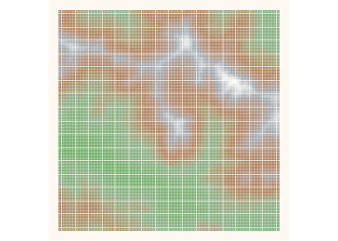

01\_points
================

Elevation data from
<https://www.swisstopo.admin.ch/de/geodata/height/alti3d.html>

``` r
# dat <- readr::read_delim(here::here("30daymapchallenge/21_elevation/50cmres/SWISSALTI3D_0.5_XYZ_CHLV95_LN02_2814_1175.xyz"), delim = " ", n_max = 5000)
# dat <- readr::read_delim(here::here("30daymapchallenge/21_elevation/2mres/SWISSALTI3D_2_XYZ_CHLV95_LN02_2813_1169.xyz"), delim = " ")
zips <- list.files(here::here("30daymapchallenge/21_elevation/2mres"), ".zip", full.names = TRUE)

dat <- lapply(zips, function(x){
  files <- unzip(x, list = TRUE)
  out <- read_delim(unz(x, files$Name), delim = " ") 
  # out[seq(1, nrow(out), 100), ]
  out
}) %>% 
  bind_rows 

sumdat <- dat %>% 
  mutate(across(1:2, function(x) round(x / 50))) %>% 
  group_by(X, Y) %>% 
  summarize(mean = max(Z))

# LV95 - EPSG: 2056
# longlat - EPSG: 4326

# sfdat <- dat %>% 
#   st_as_sf(coords = c("X", "Y")) %>% 
#   st_set_crs(2056) %>% 
#   st_transform(4326)
# 
# bbox <- st_bbox(sfdat)
# 
# dat2 <- bind_cols(dat, 
#                   st_coordinates(sfdat) %>% 
#                     as.data.frame() %>% 
#                     rename(x = X, y = Y))
# 
# 
# poi <- tibble::tribble(~y, ~x, ~name,
#   46.66327489651576, 10.241395083422965, "Stabelchod",
#   46.673519021854986, 10.232407294726421, "Val dal Botsch",
#   46.67529171393013, 10.244628827518664, "Margunet",
#   46.672354603930124, 10.245719570624154, "forgot the name",
#   46.66586004154945, 10.18863320093557, "Grimmels"
#                        
#                        )

# library(isoband)
# iso <- isobands(x = dat$x, y = dat$y, z = dat$Z, levels_low = 1850, levels_high = 3200)
```

``` r
sumdat %>% 
  # ggplot(aes(x = x, y = y, z = Z, fill = Z, col = Z)) +
  ggplot(aes(x = X, y = Y, z = mean)) +
  # geom_tile() +
  geom_point(aes(col = mean), size = .86) +
  # geom_contour() 
  scale_color_gradientn(colours = c("forestgreen", "palegreen4", "saddlebrown", "slategrey", "white")) +
  theme_void() +
  guides(colour = "none") +
  coord_equal() +
  theme(panel.background = element_rect(fill = "#faebd750", colour = NA))
```

<!-- -->

``` r
ggsave(here::here("30daymapchallenge/01_point/fig.png"))
```

    ## Saving 7 x 5 in image

``` r
  # geom_contour_filled() +
  # coord_equal() +
  # geom_point(aes(x = x, y = y), poi, inherit.aes = FALSE, col = "red")


# sfdat %>% 
#   stars::st_contour() %>% 
#   ggplot() +
#   geom_sf()
```
