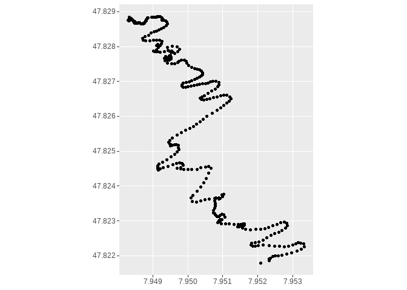
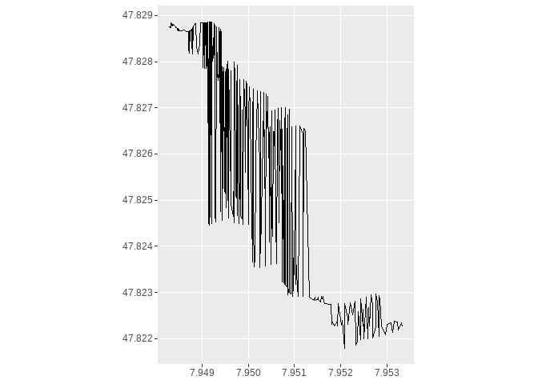
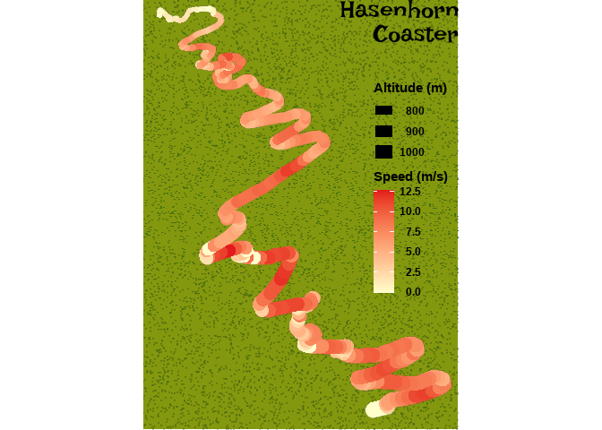

02\_lines
================

``` r
dat <- readr::read_csv(here::here("30daymapchallenge/02_line/20211010-140208 - Todtnau.txt"))
```

    ## 
    ## -- Column specification --------------------------------------------------------
    ## cols(
    ##   type = col_character(),
    ##   `date time` = col_datetime(format = ""),
    ##   latitude = col_double(),
    ##   longitude = col_double(),
    ##   `accuracy(m)` = col_double(),
    ##   `altitude(m)` = col_double(),
    ##   `geoid_height(m)` = col_logical(),
    ##   `speed(m/s)` = col_double(),
    ##   `bearing(deg)` = col_double(),
    ##   sat_used = col_double(),
    ##   sat_inview = col_double(),
    ##   name = col_character(),
    ##   desc = col_character()
    ## )

``` r
dat <- janitor::clean_names(dat)


sfdat <- dat %>% 
  filter(latitude < 47.831) %>% 
  filter(longitude < 7.955) %>% 
  mutate(dt = lubridate::as_datetime(date_time)) %>% 
  filter(dt > lubridate::as_datetime("2021-10-10 14:06:00")) %>% 
  filter(dt < lubridate::as_datetime("2021-10-10 14:29:00")) %>% 
  st_as_sf(coords = c("longitude", "latitude")) 

sfdat %>% 
  ggplot() +
  # geom_sf(aes(col = altitude_m))
  geom_sf()
```

<!-- -->

``` r
sfdat_line <- sfdat %>% 
  group_by(group = 1) %>% 
  summarize() %>% 
  st_cast("LINESTRING")

sfdat_line %>% 
  ggplot() +
  # geom_sf(aes(col = altitude_m))
  geom_sf(
    # aes(col = speed_m_s)
    )
```

<!-- -->

``` r
# 
# # another try
# points <- st_cast(st_geometry(sfdat), "POINT") 
# 
# # Number of total linestrings to be created
# n <- nrow(sfdat) - 1
# 
# # Build linestrings
# linestrings <- lapply(X = 1:n, FUN = function(x) {
# 
#   pair <- st_combine(c(points[x], points[x + 1]))
#   line <- st_cast(pair, "LINESTRING")
#   return(line)
# 
# })
# 
# # One MULTILINESTRING object with all the LINESTRINGS
# multilinestring <- st_multilinestring(do.call("rbind", linestrings))
# 
# 
# multilinestring %>% 
#   ggplot() +
#   geom_sf(aes(col = sfdat$speed_m_s[1:n]))
```

``` r
library(showtext)
```

    ## Lade nötiges Paket: sysfonts

    ## Lade nötiges Paket: showtextdb

``` r
font_add_google("Irish Grover", "Irish Grover")

font_families()
```

    ## [1] "sans"         "serif"        "mono"         "wqy-microhei" "Irish Grover"

``` r
# https://stackoverflow.com/questions/46717440/map-aesthetics-to-linestring-geometries-with-sf-in-r
ldat <- sfdat %>% 
  slice(rep(1:n(), each = 2)) %>%
  slice(-c(1, n())) %>%
  mutate(linegroup = lapply(1:(n()/2), function(x) rep(x, 2)) %>% unlist) %>% 
  ungroup
line <- st_as_sf(ldat, coords = c("long", "lat"), crs = 4326) %>%
  group_by(linegroup) %>%
  summarise(speed = last(speed_m_s), 
            accuracy = last(accuracy_m), 
            altitude = last(altitude_m), 
            do_union = FALSE) %>%
  st_cast("LINESTRING")


speckle <- function(x, colour, proportion) {
  raster_dim <- dim(x)
  n_pixels <- prod(raster_dim)
  n_speckles <- n_pixels * proportion
  x[sample(length(x), n_speckles)] <- farver::encode_native(colour)
  x
}

g <- ggplot(line) +
  ggfx::with_custom(
  geom_sf(aes(color = speed, 
              size = altitude
              ), 
          show.legend = "line", 
          lineend = "round"
          ),
    filter = speckle,
    colour = 'forestgreen',
    proportion = 0.05
  
  ) +
  geom_sf(aes(color = speed, 
              size = altitude
              ), 
          show.legend = "line", 
          lineend = "round"
          ) +

  labs(title = "Hasenhorn\nCoaster") +
  scale_color_continuous(name = "Speed (m/s)", low = "#ffffcc", high = "#e31a1c") +
  scale_size_continuous(name = "Altitude (m)") +
  theme_void() +
  theme(
    plot.background = element_rect(fill = rgb(180,209,19, maxColorValue = 350), colour = NA),
    plot.title = element_text(hjust = 1, 
                              family = "Irish Grover", 
                              size = 20,
                              margin = margin(t = 0, b = -50)),
    plot.title.position = "panel",
    legend.position=c(.85,.55),
    legend.title = element_text(face = "bold", hjust = 1),
    legend.text = element_text(face = "bold", hjust = 1)
  )

g
```

<!-- -->

``` r
# library(cowplot)
# 
# g +
#   draw_image("30daymapchallenge/02_line/Logo.png", scale = .5)
```
