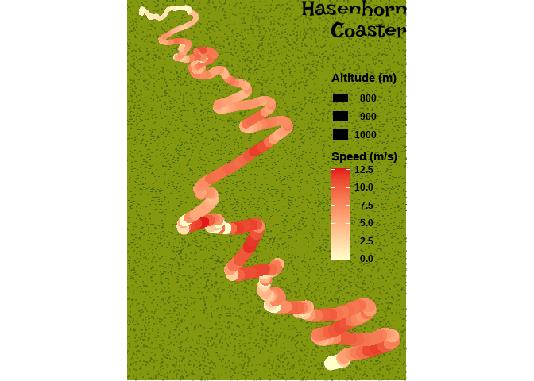
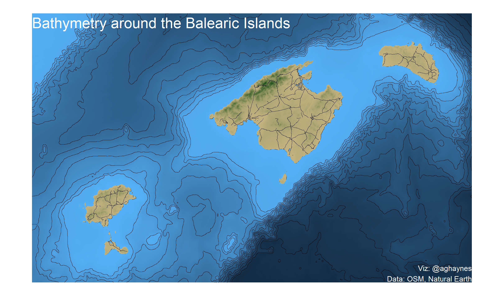

# 30DayMapChallenge

Technically not TidyTuesday, but close enough... See here for info... [https://github.com/tjukanovt/30DayMapChallenge](https://github.com/tjukanovt/30DayMapChallenge)

## Contributions

Day 1 - point 

Day 2 - line

Day 3 - polygon

Day 4 - hex

Day 5 - OSM

Day 6 - red

Day 7 - green

Day 8 - blue

 

Day 9 - monochrome

Day 10 - raster

Day 11 - 3D

Day 12 - population

Day 13 - Narural Earth

 

Day 14 - newtool

Day 15 - no computer

Day 16 - urban 

Day 17 - land 

Day 18 - water 

Day 19 - island 

Day 20 - movement

Day 21 - elevation
 

Day 22 - boundary

Day 23 - Global human settlement layer

Day 24 - historical

Day 25 - interactive

Day 26 - choropleth

Day 27 - heatmap

Day 28 - not flat

Day 29 - NULL

Day 30 - metamapping

THIS!!!

## Other links worth looking at...

[Loads of R plots, with code here](https://david.frigge.nz/3RDayMapChallenge/index.html)

[See here for other maps](https://github.com/hn303/30DayMapChallenge-Bot) (based on retweet/like stats)
