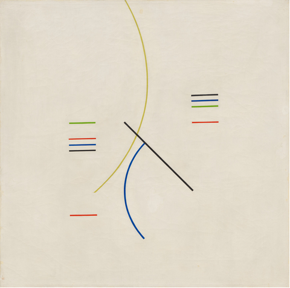

```{r setup, include=FALSE}
knitr::opts_chunk$set(echo = TRUE)
```


```{r, eval=FALSE}
library(digitize)

coords <- digitize("Alfredo Hlito. Curves and Straight Series. 1948 _ MoMA.png")

```


```{r}
coords <- structure(list(x = c(0.242656449553001, 0.333333333333333, 0.237547892720307, 
0.328224776500639, 0.23882503192848, 0.330779054916986, 0.236270753512133, 
0.328224776500639, 0.240102171136654, 0.326947637292465, 0.661558109833972, 
0.756066411238825, 0.661558109833972, 0.752234993614304, 0.659003831417625, 
0.754789272030651, 0.659003831417625, 0.754789272030651, 0.42911877394636, 
0.666666666666667, 0.499361430395913, 0.496807151979566, 0.324393358876117, 
0.431673052362708), y = c(0.248216833095578, 0.252496433666191, 
0.473609129814551, 0.476462196861626, 0.495007132667618, 0.496433666191156, 
0.514978601997147, 0.517831669044223, 0.572039942938659, 0.572039942938659, 
0.572039942938659, 0.574893009985735, 0.627674750356633, 0.630527817403709, 
0.6490727532097, 0.651925820256776, 0.66904422253923, 0.670470756062768, 
0.572039942938659, 0.338088445078459, 0.500713266761769, 0.171184022824536, 
0.328102710413695, 0.998573466476462)), class = "data.frame", row.names = c(NA, 
-24L))

plot(y ~ x, coords)
```

```{r}
library(tidyverse)


df <- coords %>% 
  mutate(line = rep(1:12, each = 2),
         end = rep(0:1, times = 12)) %>% 
  pivot_wider(c(line, end), values_from = c(x, y), names_from = end) %>% 
  mutate(set = case_when(1:n() %in% 1:5 ~ 1,
                         1:n() %in% 6:9 ~ 2,
                         TRUE ~ 3))
s <- df %>% 
  group_by(set) %>% 
  summarize(across(x_0:y_1, mean))
  
df2 <- df %>% 
  mutate(x_0 = case_when(set == 1 ~ s$x_0[s$set == 1],
                         set == 2 ~ s$x_0[s$set == 2],
                        TRUE ~ x_0),
        x_1 = case_when(set == 1 ~ s$x_1[s$set == 1],
                        set == 2 ~ s$x_1[s$set == 2],
                        TRUE ~ x_1)) 

blue <- "#275d9fff"
red <- "#d31d04ff"
green <- "#7ca82eff"
lwd <- 1
ggplot(mapping = aes(x = x_0, xend = x_1, y = y_0, yend = y_1)) +
  # geom_segment(data = df2[df2$set %in% 1:2,]) +
  geom_segment(data = df2[1,], lwd = lwd, col = red) +
  geom_segment(data = df2[2,], lwd = lwd) +
  geom_segment(data = df2[3,], lwd = lwd, col = blue) +
  geom_segment(data = df2[4,], lwd = lwd, col = red) +
  geom_segment(data = df2[5,], lwd = lwd, col = green) +
  geom_segment(data = df2[6,], lwd = lwd, col = red) + 
  geom_segment(data = df2[7,], lwd = lwd, col = green) +
  geom_segment(data = df2[8,], lwd = lwd, col = blue) +
  geom_segment(data = df2[9,], lwd = lwd) +
  geom_curve(data = df2[12,], lwd = lwd, col = "#c2b453ff", curvature = .4) +
  geom_segment(data = df2[10,], lwd = lwd) +
  geom_curve(data = df2[11,], lwd = lwd, col = blue, curvature = .4) +
  theme_classic() +
  theme(panel.background = element_rect(fill = "#e4dccfff")
        , axis.line = element_blank()
        , axis.text = element_blank()
        , axis.ticks = element_blank() 
        , axis.title = element_blank() 
        , plot.margin = unit(c(0,0,0,0), "mm")
        , panel.grid=element_blank() 
        , panel.border=element_blank()
        
        ) +
  scale_x_continuous(expand=c(0,0), limits = c(0, 1)) +
  scale_y_continuous(expand=c(0,0), limits = c(0, 1)) +
  labs(x = NULL, y = NULL) +
  coord_fixed()


```

Original:



